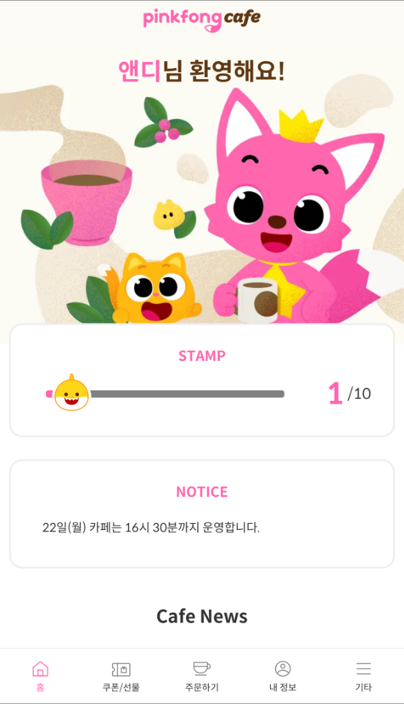

상반기 회고록을 작성한 지 벌써 몇 달이 지났습니다. 그때 채용연계형 인턴에 최종 합격했다고 적었는데, 이제는 벌써 그 인턴 생활을 마무리하며 하반기를 돌아볼 시간이 왔습니다. 상반기에는 GDGoC KNU 리드로서의 활동과 취업 준비 과정을 담았다면, 이번에는 실제 현업에서의 경험과 그 과정에서 배운 것들을 정리해보려 합니다.

## 인턴에서 보낸 시간들

인턴 기간 동안 총 3개의 프로젝트를 맡아 진행했습니다.

### 1. 카페 서비스 레거시 개선

처음으로 맡은 프로젝트였습니다. 운이 좋게도 성능 개선 과정에서 고민했던 내용이 [회사 기술 블로그](https://medium.com/pinkfong/next-js-app-router%EC%97%90%EC%84%9C-prefetchquery%EC%99%80-suspense%EB%A1%9C-%EC%9A%B0%EC%95%84%ED%95%98%EA%B2%8C-%EB%8D%B0%EC%9D%B4%ED%84%B0-%EC%8A%A4%ED%8A%B8%EB%A6%AC%EB%B0%8D%ED%95%98%EA%B8%B0-acb3d90cd5bc)에 실리기도 했습니다. 총괄 매니저님의 운영 혼선을 줄이고자 기능들을 추가하면서, 처음으로 "살아 숨 쉬는 코드"가 무엇인지 느끼게 해준 서비스였습니다.

_핑크퐁 카페 서비스 화면_

### 2. 대용량 파일 저장소 및 플레이어 서비스 (PoC)

약 2개월간 실 서비스 투입 전 PoC 형태로 개발한 프로젝트입니다. 70GB에 달하는 대용량 파일을 빠르고 안정적으로, 네트워크가 불안정한 환경에서도 업로드/다운로드할 수 있는 방법을 깊이 고민했습니다. 라이브러리에 의존하지 않고 Web API만으로 어디까지 구현할 수 있는지 끝까지 파고들었습니다.

이 과정에서 CloudFront가 50GB 이상 파일은 캐싱이 적용되지 않는 이슈를 발견했고, 팀장님과 논의하며 해결책을 제안했습니다. 이 아이디어를 팀장님께서 실제로 담당하시는 다른 프로젝트에도 적용하셨다고 들었을 때, 제 고민이 헛되지 않았다는 걸 느꼈습니다.

### 3. 콘텐츠 피드백 서비스

무에서 유를 만든 프로젝트였습니다. 콘텐츠 제작 과정에서 발생하는 피드백 채널 파편화와 커뮤니케이션 비효율 문제를 해결하기 위해, 영상과 디자인 초안 등 모든 중간 산출물을 한 곳에서 관리하는 통합 피드백 시스템을 개발했습니다.

저는 그중 영상 플레이어를 담당했습니다. 프레임 단위 정밀 피드백, 스트리밍 품질 최적화, 수정 전/후 비교 UI 등 제가 보여줄 수 있는 최대의 강점을 발휘했다고 생각합니다. 특히 시크바 프리뷰 이미지 응답 속도를 6ms까지 최적화했을 때, 팀장님께서 "완성도가 거의 완성품에 가깝네요. 깔끔하게 잘 고민하시고 개발하신 것 같아요"라고 칭찬해주셨습니다.

각 프로젝트에서 고민했던 기술적인 내용들은 별도의 글에서 더 자세히 다뤄보려고 합니다.

## 동료들에게 받은 피드백

인턴 생활을 하면서 가장 인상 깊었던 것 중 하나는 동료평가였습니다. 제가 미처 인식하지 못했던 저의 모습을 타인의 시선으로 바라볼 수 있었기 때문입니다.

동료분들은 제가 **사회성이 정말 좋다**고 이야기해주셨습니다. 팀 내에서 소통하고 협업하는 과정에서 자연스럽게 분위기를 이끌어가는 편이라고 하셨습니다. 그리고 무엇보다 **하나의 기능을 끈기 있게 파고드는 것**을 잘한다는 피드백을 받았습니다. 덕분에 다른 사람들이 생각하지 못한 구현 방식을 발견해내어 팀에 도움을 줄 때가 많았다고 합니다.

특히 팀장님과 회사 동호회에서 만난 분들이 해주신 말씀이 기억에 남습니다. 저보고 인턴 같지 않고 마치 예전부터 회사에 다녔던 사람 같다고, 함께 있으면 엄청 편하다고 하셨습니다. 심지어 "이런저런 이야기도 더 나눠보고 싶다"라는 말까지 해주셨습니다. 짧은 인턴 기간이었지만 다양한 분들과 자연스럽게 어울릴 수 있어서 감사했습니다.

하지만 동시에 개선해야 할 점도 들었습니다. 그 끈기가 때로는 **오버엔지니어링**으로 이어진다는 것이었습니다. 하나의 기능을 구현할 때 이것도 고민하고, 저것도 고민하다 보니 필요 이상으로 복잡하게 개발하게 되는 경향이 있다고 하셨습니다. 적절한 선에서 고민을 멈추고 실용적인 해결책을 선택하는 연습이 필요하다는 것을 깨달았습니다.

## 인턴을 하면서 배운 것들

### 프론트엔드를 바라보는 시선이 바뀌었습니다

학생 때는 프론트엔드를 코드 구조를 깔끔하게 짜고, 성능 최적화에만 집중하는 것이라고 생각했습니다. 하지만 현업에서 일해보니 생각이 완전히 바뀌었습니다. **서비스 전체를 이해하고, 사용자의 접근성까지 고민하는 것**이 진짜 프론트엔드라는 걸 깨달았습니다.

### 생각보다 라이브러리를 많이 씁니다

회사에 오기 전에는 "현업에서는 다 직접 만들겠지"라고 막연히 생각했는데, 현실은 달랐습니다. 검증된 라이브러리를 적극적으로 활용하고, 비즈니스 로직에 집중하는 게 효율적이라는 걸 배웠습니다. 물론 직접 개발하면 비용을 아끼고 원하는 기능을 유연하게 추가할 수 있지만, **유지보수 부담이 늘어난다는 트레이드오프**가 있다는 것도 알게 되었습니다.

학생 때 "그냥 라이브러리 가져다 쓰는 거잖아요"라는 말을 들은 적이 있는데, 지금 생각해보면 아쉬운 시선이었습니다. 라이브러리를 활용하면 개발 생산성이 올라가고, 그만큼 비즈니스 로직이나 UX 개선에 시간을 쓸 수 있거든요. "이 라이브러리를 써서 어떤 사용자 경험을 개선할 수 있을까?"라는 관점으로 접근했더라면, 더 의미 있는 결과물을 만들 수 있지 않았을까 싶습니다.

### 소통을 잘하는 개발자가 최고입니다

기술력도 중요하지만, 결국 **자신의 생각을 잘 공유하고 소통하는 개발자**가 팀에서 가장 빛난다는 걸 느꼈습니다. 좋은 아이디어도 공유하지 않으면 의미가 없고, 막히는 부분을 솔직히 나누면 더 빨리 해결됩니다.

### CS 공부, 진짜 필요하더라고요

학교 다닐 때는 운영체제, 네트워크 같은 CS 과목이 왜 필요한지 잘 와닿지 않았습니다. 하지만 실제로 대용량 파일 업로드/다운로드를 구현하면서 네트워크 지식이 필요했고, 영상 변환 아키텍처를 설계하면서 동시성 제어나 백프레셔 같은 개념이 필요했습니다. **학교에서 배운 것들이 현업에서 진짜 쓰인다**는 걸 몸소 느꼈습니다.

### 부트캠프보다 인턴이었습니다

개인적인 생각이지만, 일반적인 부트캠프에서 배우는 것과 인턴으로 실제 서비스를 개발하는 건 차원이 다르다고 느꼈습니다. 물론 소프트웨어 마에스트로, 네이버 부스트캠프, SSAFY처럼 체계적이고 퀄리티 높은 프로그램을 수료한 분들은 인턴 경험자와 비슷한 수준일 거라고 생각합니다. 하지만 실제 사용자가 있는 서비스에서 문제를 마주하고, 동료들과 협업하며 해결해나가는 경험은 어디서도 얻기 어려운 것 같습니다.

## 앞으로 어떤 개발자가 되고 싶은가

내년에는 "기능을 이해하고, 동료에게 아하 모먼트를 주는 개발자"가 되는 것이 제 목표입니다.

돌이켜보면 2025년까지의 저는 실제 서비스를 운영해본 경험이 많이 부족했습니다. 동아리나 사이드 프로젝트에서 개발은 해봤지만, 실제 사용자가 있는 서비스에서 문제를 마주하고 해결해본 적은 거의 없었습니다.

내년에는 다릅니다. 회사라는 검증된 환경에서 실제 사용자들이 서비스를 어떻게 사용하는지, 어디서 불편함을 느끼는지를 직접 체감하고 싶습니다. 그리고 그 경험을 바탕으로 **기능이 사용자에게 어떤 가치를 주는지 먼저 이해하는 개발자**가 되고 싶습니다.

왜 이 기능이 필요한지, 사용자에게 어떤 문제를 해결해주는지를 깊이 고민하고, 그 위에서 **동료들에게 '아하 모먼트'를 선사하는 해결책**을 직접 만들어내고 싶습니다. 함께 일하는 사람들이 저와 협업하면서 "아, 이런 방법도 있구나!", "이렇게 생각할 수 있구나!"라는 깨달음을 얻을 수 있도록요.

---

2025년은 제게 정말 의미 있는 한 해였습니다. 인턴을 통해 처음으로 현업을 경험하면서, 학생 때는 몰랐던 것들을 많이 배웠습니다. 동시에 제 강점과 개선점도 명확히 알게 되었고요.

이 글이 인턴이나 취업을 준비하시는 분들께 조금이나마 도움이 되었으면 좋겠습니다. 2026년에는 더 성장한 모습으로 돌아오겠습니다. 감사합니다.
