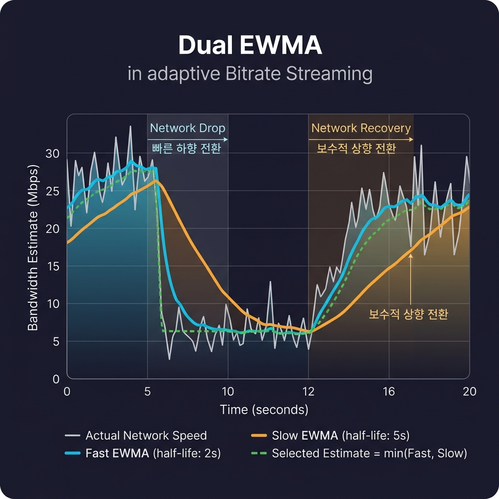
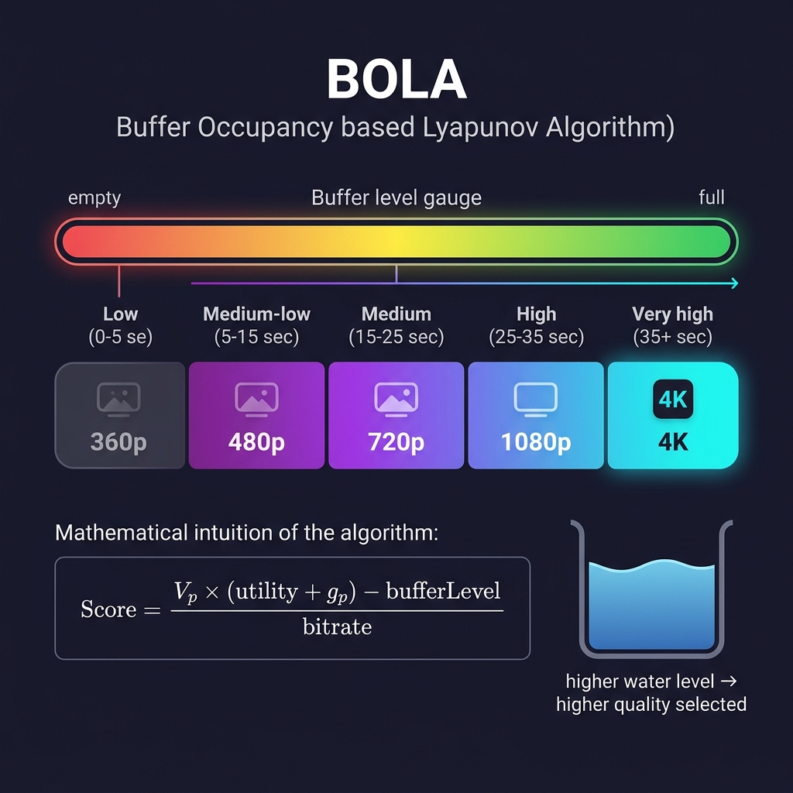

오픈소스 미디어 플레이어인 [Shaka Player](https://github.com/shaka-project/shaka-player)에 [dropped frame 감지 PR](https://github.com/shaka-project/shaka-player/pull/9918)을 올렸다가, 리뷰에서 이런 댓글을 받았습니다.


Shaka의 ABR이 [dash.js](https://github.com/Dash-Industry-Forum/dash.js)에 비해 단순하다는 지적이었는데, 솔직히 그때는 EWMA가 뭔지, dash.js의 rule-based ABR이 어떻게 다른지도 잘 몰랐습니다. 이 글은 그 댓글을 계기로 ABR의 동작 원리를 공부한 과정을 정리한 것입니다.

## ABR이란?

그래서 ABR이란 무엇일까요? ABR은 Adaptive Bitrate Streaming의 약자로, 쉽게 말하자면 아래 사진처럼 스트리밍 서비스에서 흔히 볼 수 있는 화질 선택 메뉴에서 '자동'을 선택했을 때 동작하는 기술입니다.


네트워크 상태나 기기 성능에 따라 자동으로 최적의 화질을 선택해주는 기술인데요. 아래 그림처럼, 플레이어는 영상을 짧은 세그먼트 단위로 다운로드하면서 네트워크 상태를 지속적으로 모니터링합니다. 네트워크가 빠르면 높은 비트레이트(고화질)의 세그먼트를, 느려지면 낮은 비트레이트(저화질)의 세그먼트를 선택하여 버퍼링 없는 재생을 유지합니다.


<small>출처: [Bitmovin - Adaptive Streaming](https://bitmovin.com/blog/adaptive-streaming/)</small>

이때 플레이어가 "어떤 화질을 선택할 수 있는가"는 manifest 파일(HLS의 `.m3u8`, DASH의 `.mpd`)에 정의되어 있습니다. 플레이어는 재생 시작 시 이 파일을 먼저 다운로드하여 사용 가능한 화질 목록을 파악하고, 이후 매 세그먼트마다 ABR 알고리즘이 현재 상태에 맞는 비트레이트를 결정합니다.

실제 manifest 파일이 어떻게 생겼는지 살펴보겠습니다. 아래는 HLS manifest(`.m3u8`)의 예시입니다.

```plaintext
#EXTM3U                        ← HLS 매니페스트 시작 선언

#EXT-X-MEDIA:TYPE=AUDIO,       ← 오디오 트랙 정의
  URI="playlist_a-eng-0128k-aac-2c.mp4.m3u8",
  GROUP-ID="default-audio-group",
  LANGUAGE="en",CHANNELS="2"

                               ↓ 각 화질별 스트림 정보 (ABR이 이 중에서 선택)

#EXT-X-STREAM-INF:             ← 144p 스트림
  BANDWIDTH=255636,            ← 최대 비트레이트 (bps)
  CODECS="avc1.42c01e,mp4a.40.2",  ← 비디오: H.264 Baseline / 오디오: AAC
  RESOLUTION=250x144,          ← 해상도
  AUDIO="default-audio-group"  ← 사용할 오디오 그룹
playlist_v-0144p-0100k-libx264.mp4.m3u8  ← 이 화질의 세그먼트 목록 파일

#EXT-X-STREAM-INF:             ← 360p 스트림
  BANDWIDTH=909696,
  CODECS="avc1.4d401f,mp4a.40.2",
  RESOLUTION=626x360,
  AUDIO="default-audio-group"
playlist_v-0360p-0750k-libx264.mp4.m3u8

#EXT-X-STREAM-INF:             ← 576p 스트림
  BANDWIDTH=1599186,
  CODECS="avc1.4d401f,mp4a.40.2",
  RESOLUTION=1002x576,
  AUDIO="default-audio-group"
playlist_v-0576p-1400k-libx264.mp4.m3u8

#EXT-X-STREAM-INF:             ← 720p 스트림
  BANDWIDTH=2778640,
  CODECS="avc1.4d401f,mp4a.40.2",
  RESOLUTION=1252x720,
  AUDIO="default-audio-group"
playlist_v-0720p-2500k-libx264.mp4.m3u8
```

이처럼 mainfest파일에는 144p부터 720p까지 여러 화질이 정의되어 있습니다. 플레이어는 이 목록을 받아온 뒤, 세그먼트를 다운로드할 때마다 네트워크 상태를 측정하고 그에 맞는 화질을 실시간으로 선택합니다. 이 과정이 반복되면서, 사용자는 버퍼링 없이 그 순간 가능한 최고 화질로 영상을 시청할 수 있게 됩니다.

그런데 여기서 핵심적인 질문이 생깁니다. 매니페스트에서 어떤 화질을 고를지, 즉 지금 네트워크가 충분히 빠른지 어떻게 판단할까요? 단순히 마지막 다운로드 속도만 보면 될까요?, 아니면 버퍼에 쌓인 양을 봐야 할까요? 이 판단 방식에 따라 ABR 알고리즘이 나뉩니다.

## ABR 알고리즘의 분류

ABR 알고리즘은 크게 두 가지 접근법으로 분류할 수 있습니다.

|         분류         |   핵심 지표   | 대표 알고리즘 |        사용처        |
| :------------------: | :-----------: | :-----------: | :------------------: |
| **Throughput-based** | 네트워크 속도 |     EWMA      | Shaka Player, hls.js |
|   **Buffer-based**   |   버퍼 수준   |     BOLA      |       dash.js        |

**Throughput-based** 알고리즘은 최근 다운로드 속도를 측정하여 "이 정도 속도면 어떤 화질까지 감당할 수 있는가"를 계산합니다. 직관적이고 구현이 간단하지만, 버퍼 상태를 고려하지 않아 버퍼가 거의 비어있어도 높은 화질을 선택할 수 있다는 한계가 있습니다.

**Buffer-based** 알고리즘은 현재 버퍼에 얼마나 많은 데이터가 쌓여있는지를 기준으로 판단합니다. 버퍼가 넉넉하면 높은 화질을, 버퍼가 부족하면 낮은 화질을 선택합니다. throughput 측정이 불필요하다는 장점이 있지만, 재생 시작이나 탐색(seek) 직후처럼 버퍼가 비어있는 상황에서는 판단이 어렵습니다.

## Throughput-based: EWMA

### EWMA란?

EWMA(Exponentially Weighted Moving Average, 지수 가중 이동 평균)는 최근 측정값일수록 더 중요하게 반영하는 평균 계산 방식입니다.

예를 들어 최근 5개 세그먼트의 다운로드 속도가 이렇다고 해봅시다.

```
10Mbps → 10Mbps → 10Mbps → 2Mbps → 2Mbps
```

단순 평균을 내면 (10+10+10+2+2)/5 = 6.8Mbps입니다. 하지만 지금 실제 네트워크 속도는 2Mbps인데, 6.8Mbps로 추정하면 높은 화질을 선택하게 되고 버퍼링이 발생합니다.

EWMA는 최근 값인 2Mbps에 더 큰 비중을 두기 때문에 2~3Mbps 근처로 추정합니다. 이때 "얼마나 최근 값을 중시할 것인가"를 결정하는 것이 half-life입니다. half-life가 짧으면 최근 값에 민감하게 반응하고, 길면 과거 값도 많이 반영하여 안정적으로 변화합니다.

### Dual EWMA: Shaka Player의 접근법

Shaka Player는 하나가 아닌 두 개의 EWMA를 동시에 운영합니다.

```javascript
// Shaka Player - ewma_bandwidth_estimator.js
this.fast_ = new shaka.abr.Ewma(2); // 반감기 2초: 빠르게 반응
this.slow_ = new shaka.abr.Ewma(5); // 반감기 5초: 안정적 추정
```

세그먼트를 다운로드할 때마다 두 EWMA에 동일한 샘플을 넣고, 최종 대역폭 추정값은 둘 중 더 낮은 값을 선택합니다.

```javascript
getBandwidthEstimate(defaultEstimate) {
    if (this.bytesSampled_ < this.minTotalBytes_) {
        return defaultEstimate;  // 128KB 미만이면 아직 신뢰할 수 없음
    }
    return Math.min(this.fast_.getEstimate(), this.slow_.getEstimate());
}
```

이 `Math.min` 전략이 핵심인데요, 결국 아래의 네트워크 상황에 맞게 네트워크가 느려질 경우 fast EWMA가 먼저 낮아지기 때문에 버퍼링 방지를 위해 화질을 빠르게 낮추게 되고, 네트워크가 빨라질 경우 slow EWMA가 여전히 낮으므로 천천히 화질을 올리게 됩니다.

> [ewma_bandwidth_estimator.js 전체 소스코드](https://github.com/shaka-project/shaka-player/blob/main/lib/abr/ewma_bandwidth_estimator.js)



- **네트워크가 느려질 때**: fast EWMA가 먼저 낮아지므로 → 빠르게 화질을 낮춤 (버퍼링 방지)
- **네트워크가 빨라질 때**: slow EWMA가 여전히 낮으므로 → 천천히 화질을 올림 (불안정한 전환 방지)

즉, 하향 전환은 빠르게, 상향 전환은 보수적으로 동작합니다. 사용자 경험 관점에서 갑자기 화질이 떨어지는 것보다는, 천천히 올라가는 것이 훨씬 자연스럽기 때문입니다.

### 비트레이트 선택 로직

추정된 대역폭을 바탕으로 실제 화질을 선택할 때, Shaka Player는 업그레이드와 다운그레이드에 서로 다른 여유 마진을 둡니다. `chooseVariant()` 메서드에서 각 화질의 대역폭 범위를 계산하는 핵심 로직은 다음과 같습니다.

```javascript
// Shaka Player - simple_abr_manager.js의 chooseVariant()
// 현재 화질을 유지하기 위한 최소 대역폭 (config 기본값: 0.95)
const minBandwidth = itemBandwidth / this.config_.bandwidthDowngradeTarget;
// 다음 화질로 올리기 위한 최대 대역폭 (config 기본값: 0.85)
const maxBandwidth = nextBandwidth / this.config_.bandwidthUpgradeTarget;

// 현재 대역폭이 이 범위 안에 있으면 해당 화질을 선택
if (currentBandwidth >= minBandwidth && currentBandwidth <= maxBandwidth) {
  chosen = item;
}
```

예를 들어 1080p 스트림의 비트레이트가 5Mbps라면, 이 화질로 올리려면 약 5.88Mbps(5/0.85)의 대역폭이 필요하고, 유지하려면 최소 5.26Mbps(5/0.95)가 필요합니다. 이런 마진을 두는 이유는 네트워크 속도의 일시적인 변동에 대비하기 위해서입니다.

> [simple_abr_manager.js 전체 소스코드](https://github.com/shaka-project/shaka-player/blob/main/lib/abr/simple_abr_manager.js)

## Buffer-based: BOLA

### BOLA란?

BOLA(Buffer Occupancy based Lyapunov Algorithm)는 Akamai에서 개발한 알고리즘으로, 네트워크 속도를 측정하지 않고 버퍼에 쌓인 양만 보고 비트레이트를 결정합니다.

발상은 단순합니다. 버퍼가 넉넉하면 당장 버퍼링 걱정이 없으니 높은 화질을 선택하고, 버퍼가 줄어들면 안전하게 낮은 화질로 내려가는 것입니다. BOLA는 각 화질에 대해 "이 버퍼 수준에서 이 화질을 선택하면 얼마나 효율적인가"를 스코어로 계산하고, 가장 높은 스코어의 화질을 선택합니다.

```javascript
// dash.js - BolaRule.js
// 각 화질의 스코어를 계산하여 가장 높은 스코어의 화질을 선택
for (let i = 0; i < bitrateCount; ++i) {
  let s = (Vp * (utilities[i] - 1 + gp) - bufferLevel) / bitrate[i];
  if (isNaN(score) || s >= score) {
    score = s;
    quality = i;
  }
}
```

직관적으로 해석하면 버퍼가 많이 쌓여있을수록 높은 비트레이트의 스코어가 올라가고, 버퍼가 줄어들면 낮은 비트레이트가 선택되는 구조입니다.

> [BolaRule.js 전체 소스코드](https://github.com/Dash-Industry-Forum/dash.js/blob/development/src/streaming/rules/abr/BolaRule.js)



## dash.js의 ABR: Throughput Rule과 BOLA의 조합

dash.js는 앞서 소개한 Throughput Rule과 BOLA를 버퍼 수준에 따라 동적으로 전환합니다.

```javascript
// dash.js - AbrController.js
function _updateDynamicAbrStrategy(mediaType, bufferLevel) {
  const bufferTimeDefault = mediaPlayerModel.getBufferTimeDefault();
  const switchOnThreshold = bufferTimeDefault; // BOLA 활성화 임계값
  const switchOffThreshold = 0.5 * bufferTimeDefault; // BOLA 비활성화 임계값

  const shouldUseBolaRule =
    bufferLevel >= (isUsingBolaRule ? switchOffThreshold : switchOnThreshold);
}
```

> [AbrController.js 전체 소스코드](https://github.com/Dash-Industry-Forum/dash.js/blob/development/src/streaming/controllers/AbrController.js)

- **버퍼가 적을 때** (재생 시작, seek 직후): Throughput Rule 사용 → throughput 기반으로 빠르게 적절한 화질 선택
- **버퍼가 충분히 쌓였을 때**: BOLA 사용 → 버퍼 수준 기반으로 안정적인 화질 유지

여기서 한 가지 중요한 점은, BOLA를 켜는 기준과 끄는 기준이 다르다는 것입니다. 예를 들어 버퍼가 12초 이상이면 BOLA를 켜지만, 다시 끄려면 6초 이하로 떨어져야 합니다. 만약 둘 다 같은 기준이면 버퍼가 그 근처에서 왔다 갔다 할 때마다 두 알고리즘이 계속 전환되어 불안정해지기 때문입니다.


이처럼 dash.js는 Throughput과 Buffer 두 가지 접근법의 장점을 상황에 맞게 결합하여, 단일 알고리즘만으로는 대응하기 어려운 다양한 네트워크 환경에 대처하고 있습니다.

## 다시 PR로 돌아와서

지금까지 살펴본 ABR 알고리즘들은 결국 "네트워크 상태"를 기준으로 화질을 결정합니다. 그런데 네트워크는 충분히 빠른데도 영상이 끊기는 경우가 있습니다.

')

위 이슈는 Shaka Player GitHub에 올라온 실제 사례인데, 제가 올린 PR과 관련된 이슈이기도 합니다. 2018-2019년형 Samsung, LG TV에서 1080p/60fps 스트림을 재생하면 디코딩 성능이 부족해 프레임 드롭이 발생합니다. 네트워크 대역폭은 충분하기 때문에 throughput 기반 ABR은 계속 1080p를 선택하지만, 기기가 이를 감당하지 못하는 거죠. 배속 재생도 마찬가지입니다. 1.5배속, 2배속으로 올리면 디코딩 부하가 늘어나 프레임이 드롭되는데, ABR은 네트워크 상태만 보기 때문에 이런 문제를 감지할 수 없습니다.

buffer-based ABR이라면 디코딩이 느려지면서 버퍼 소모가 빨라지는 걸 간접적으로 잡을 수 있지만, Shaka Player는 throughput-based만 사용하고 있어서 이 문제가 사각지대에 놓여 있었습니다.

### 처음 구현: Player 레벨에서 별도 처리

처음에는 단순하게 접근했습니다. `player.js`에 dropped frame 감지 로직을 직접 넣고, 저사양 기기에서 프레임 드롭 비율이 임계치를 넘으면 해당 스트림을 제한하는 방식이었습니다. ABR과는 별개의 독립적인 기능으로, 저사양 TV만을 타겟으로 구현한 거죠.

### 피드백: ABR 안으로 통합하자

그런데 maintainer는 다른 방향을 제안했습니다. 프레임 드롭을 특수 케이스로 다루는 대신, ABR 시스템 자체가 스트림을 일시적으로 비활성화할 수 있는 구조를 만들자는 것이었습니다. 이렇게 하면 dropped frame뿐 아니라 buffer health 같은 다른 지표도 같은 메커니즘으로 활용할 수 있고, 장기적으로 여러 지표를 가중치 기반으로 결합하는 방향으로 확장할 수 있다는 판단이었죠. 이미 [#9896](https://github.com/shaka-project/shaka-player/pull/9896)에서 buffer health를 고려한 선례도 있었고요.

또한 저사양 기기만 적용하려던 것도 모든 기기에서 기본 활성화하는 방향으로 바뀌었습니다. 고사양 기기에서도 켜놔도 해가 없으니, 기능으로 출시하고 버그가 있으면 고치자는 판단이었습니다.

### 리팩터링 결과

여기서 중요한 점은 기존 EWMA 기반 ABR은 그대로 유지된다는 것입니다. dropped frames 보호는 EWMA를 대체하는 게 아니라, 독립적으로 병렬 동작하는 별도의 메커니즘입니다. 둘이 보는 대상이 다르기 때문입니다.

|                    |              EWMA ABR              |     Dropped Frames 보호     |
| :----------------: | :--------------------------------: | :-------------------------: |
|   **감지 대상**    |           네트워크 병목            |         디코딩 병목         |
|   **측정 방법**    |       세그먼트 다운로드 시간       | `getVideoPlaybackQuality()` |
| **못 잡는 케이스** | 네트워크는 빠른데 기기가 느린 경우 |    네트워크가 느린 경우     |

최종적으로 동작방식을 예로 들자면, `SimpleAbrManager` 안에서 2초마다 `getVideoPlaybackQuality()`를 통해 프레임 드롭 비율을 측정하고, 15% 이상이면 현재 video stream을 30초간 비활성화합니다. 그러면 EWMA ABR이 비활성화된 스트림을 제외한 나머지 variant 중에서 자연스럽게 낮은 화질을 선택하게 됩니다.

```
EWMA: 대역폭 충분하니까 4K 선택
→ 드롭 감지: 15% 넘음, 4K를 30초간 비활성화 → 강제로 다시 선택하게 함
→ EWMA: 4K 빠졌으니 1080p 선택
→ ... 30초 후 비활성화 해제
→ EWMA: 4K 다시 선택 → 또 드롭 발생? → 또 비활성화
→ ... 반복
```

즉, dropped frames 보호가 직접 화질을 내리는 것이 아니라 "이 화질은 감당 못하니까 후보에서 빼"라고 선택지를 제한하고, 실제로 어떤 화질로 내릴지는 EWMA가 결정하는 구조로 바뀌게 되었습니다.

물론 배속 재생 시에는 디코딩 부하 증가로 프레임 드롭이 자연스럽게 발생할 수 있기 때문에 `playbackRate > 1`이면 체크를 건너뛰도록 하였습니다.

## 마무리

공부하면서 가장 인상 깊었던 건, 같은 문제를 바라보는 시각이 플레이어마다 다르다는 점이었습니다. Shaka는 Dual EWMA로 throughput만 보되 빠르게 내리고 천천히 올리자는 보수적 접근을, dash.js는 throughput과 버퍼 기반을 상황에 따라 전환하는 실용적 선택을 했습니다. 정답이 하나가 아니라, 각자의 트레이드오프 위에서 설계된 것이었죠.

그리고 리뷰 한 줄이 PR의 방향을 바꾸는 경험도 처음이었습니다. 혼자 구현했으면 Player에 로직을 넣고 끝냈을 텐데, maintainer의 피드백 덕분에 ABR 시스템 자체를 확장하는 방향으로 갈 수 있었으니까요. 오픈소스 기여의 가치가 코드 자체보다 이런 리뷰 과정에 있다는 걸 체감한 PR이었습니다.

## 참고 자료

- [dash.js ABR Rules 소스코드](https://github.com/Dash-Industry-Forum/dash.js/tree/development/src/streaming/rules/abr)
- [Shaka Player ABR 소스코드](https://github.com/shaka-project/shaka-player/tree/main/lib/abr)
- [HLS와 ABR을 통해 알아보는 라이브 스트리밍 원리](https://medium.com/@arneg0shua/hls-%EC%99%80-abr-%EC%9D%84-%ED%86%B5%ED%95%B4-%EC%95%8C%EC%95%84%EB%B3%B4%EB%8A%94-%EB%9D%BC%EC%9D%B4%EB%B8%8C-%EC%8A%A4%ED%8A%B8%EB%A6%AC%EB%B0%8D-%EC%9B%90%EB%A6%AC-949e340d7514)
- [Bitmovin - Adaptive Streaming](https://bitmovin.com/blog/adaptive-streaming/)
- [ABR 알고리즘 정리](https://blog.naver.com/jiehyunkim/202549965)
