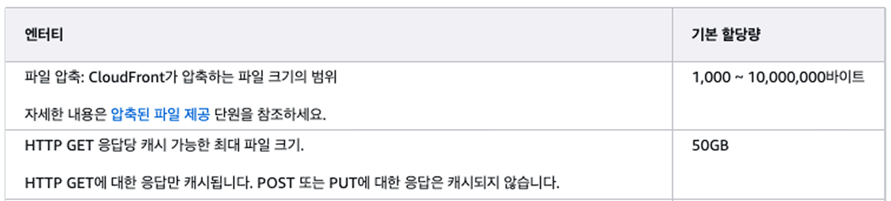
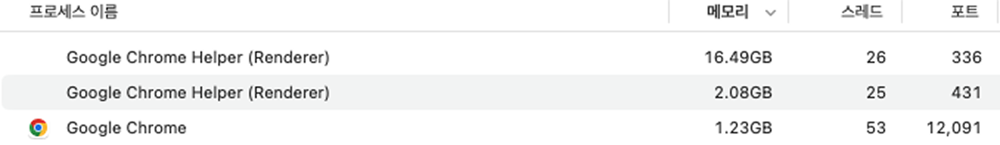
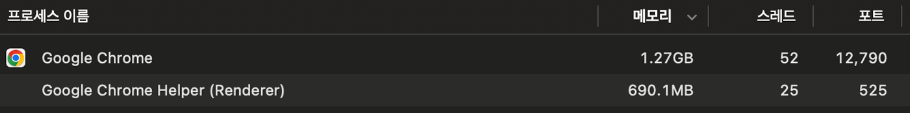

## "다운로드 버튼 하나 만들어주세요."

회사에서 처음 이 과제를 받았을 때, 다운로드는 `<a>` 태그 하나면 충분한 간단한 기능이라고 생각했습니다.

하지만 다운로드해야 할 파일의 크기가 50GB가 넘어간다는 사실을 알게 되면서, 이 기능은 **브라우저의 한계와 메모리 효율**을 고민해야 하는 과제가 되었습니다.

이 글은 다운로드 기능을 구현하면서 마주한 문제들과, FileSystem API와 Stream을 도입해 해결했던 과정을 기록합니다.

## 1. 단순 다운로드 방식의 문제점

보통 `<a href="..." download>`로 다운로드를 처리합니다. 브라우저가 알아서 스트림을 열고 파일 시스템에 저장하기 때문에 편리합니다. 하지만 파일 크기가 커지면 상황이 달라집니다. 특히 **S3**와 **CloudFront Signed URL**을 사용하는 환경에서는 여러 문제가 발생했습니다.

### 첫 번째, Signed URL 만료 문제

보안을 위해 유효기간이 있는 Signed URL을 사용하는데, 여러 파일을 동시에 다운로드하는 경우 **CloudFront Signed URL이 만료**되는 경우가 발생합니다. 이전 파일이 크다 보니 대기 시간이 길어지면 다운로드 도중에 403 에러가 발생하며 중단됩니다.

### 두 번째, 처음부터 다시 받아야 함

50GB를 받는데 2시간이 걸리는 상황에서, 99%에서 네트워크가 끊겨 다운로드가 멈춘다면 어떻게 될까요?
일반적인 브라우저 다운로드는 **이어받기**가 불가능한 경우가 많습니다. 사용자는 다시 0%부터 시작해야 합니다.

### 세 번째, 느린 속도와 캐싱 미적용

CloudFront는 기본적으로 파일을 캐싱해서 속도를 높입니다. 하지만 **파일 하나가 50GB를 넘어가면 CloudFront가 이를 전체 캐싱하지 못합니다.** 캐싱의 이점을 누리지 못한 채 원본 S3에서 데이터를 가져오게 되고, 다운로드 속도가 느려집니다.


<div class="caption">CloudFront 배포 환경에서 파일 크기 및 요청 제한 관련 주요 정책</div>

## 2. 해결책: 파일을 쪼개서 받자

이 문제들을 해결하기 위해 **청크 방식**을 떠올렸습니다. CloudFront가 50GB 전체 파일은 캐싱하지 못해도, 10MB 단위 조각은 캐싱할 수 있을 것이라는 가설이었습니다.

HTTP의 [Range header](https://developer.mozilla.org/en-US/docs/Web/HTTP/Reference/Headers/Range)를 사용하면 파일의 특정 구간만 요청할 수 있습니다.

```javascript
// 0~10MB 요청
fetch(url, {
  headers: { Range: 'bytes=0-10485759' },
});

// 10MB~20MB 요청
fetch(url, {
  headers: { Range: 'bytes=10485760-20971519' },
});
```

이 방식을 사용하면:

- **CloudFront 캐싱이 작동**: 10MB 조각은 캐싱 가능
- **이어받기가 가능**: 받지 못한 조각만 다시 요청
- **URL 만료 문제 해결**: 청크별로 URL 재발급 가능

이론상으로는 완벽했습니다. 하지만 현실은 달랐습니다.

## 3. 브라우저 메모리 문제

청크 방식으로 구현하고 테스트했는데, 새로운 문제가 발생했습니다. 바로 **메모리(RAM)** 이슈였습니다.

### 왜 메모리가 가득 찰까?

웹 브라우저에서 다운로드한 데이터를 파일로 만들려면, 모든 청크를 `Blob`으로 합쳐야 합니다. 문제는 이 과정에서 **청크들을 메모리에 모두 보관**해야 한다는 것이었습니다.

```javascript
const parts = []; // 메모리에 쌓임

// 청크를 받을 때마다 메모리에 저장
for (const chunk of chunks) {
  const data = await fetch(chunk.url).then((r) => r.arrayBuffer());
  parts.push(data); // 메모리에 계속 쌓임
}

// 모든 청크를 메모리에 모은 후 Blob 생성
const file = new Blob(parts); // 50GB 파일 → 50GB 메모리 필요
```

50GB 파일을 다운로드하면 → 브라우저 메모리도 50GB가 필요합니다.

다운로드가 진행될수록 노트북이 뜨거워지고 배터리가 빠르게 소모되었습니다. 활성 상태 보기를 확인해보니 **Chrome 프로세스의 메모리 점유율이 16.49GB**까지 올라가 있었습니다.


<div class="caption">청크를 메모리에 모으는 방식 - 70GB 파일 다운로드 시 16.49GB 메모리 사용</div>

## 4. 해결책: Stream으로 바로 디스크에 쓰기

메모리에 들고 있지 않고, **받는 즉시 디스크에 쓸 수는 없을까요?**

그 해결책이 바로 **Streams API**와 **File System Access API**입니다.

### Stream이 뭐길래?

**Stream**은 데이터를 조금씩 흘려보내는 방식입니다. 50GB를 한 번에 들고 있는 게 아니라, 10KB씩 받아서 바로바로 처리하는 거죠.

```
[기존 방식]
서버 → 메모리(50GB 전부!) → 디스크

[Stream 방식]
서버 → 메모리(10KB만) → 디스크 → 메모리(다음 10KB) → 디스크 → ...
```

- **ReadableStream**: 네트워크에서 데이터를 조금씩 읽기
- **WritableStream**: 디스크에 데이터를 조금씩 쓰기

이 두 개를 연결하면, **메모리는 거의 사용하지 않고** 네트워크에서 받은 데이터를 바로 디스크에 쓸 수 있습니다.

```javascript
// 1. 사용자에게 저장 위치 물어보기
const directoryHandle = await window.showDirectoryPicker();
const fileHandle = await directoryHandle.getFileHandle('파일.mp4', { create: true });

// 2. 디스크에 쓸 준비
const writable = await fileHandle.createWritable();

// 3. 청크 받으면서 바로바로 디스크에 쓰기
for (const chunk of chunks) {
  const response = await fetch(chunk.url, {
    headers: { Range: `bytes=${chunk.start}-${chunk.end}` },
  });

  // response.body는 ReadableStream
  const reader = response.body.getReader();

  while (true) {
    const { done, value } = await reader.read();
    if (done) break;

    // 받은 데이터를 즉시 디스크에 쓰기 (메모리에 안 쌓임!)
    await writable.write(value);
  }
}

await writable.close();
```

### 결과

이 방식을 적용한 결과, 파일을 다운로드하는 내내 **브라우저 메모리 사용량이 거의 0에 가까웠습니다.** 메모리 점유율은 **16.49GB에서 약 690MB로 95.8% 감소**했습니다.


<div class="caption">Stream 방식 적용 후 - 70GB 파일 다운로드 시 690MB만 사용</div>

## 5. 중단된 지점부터 이어받기

메모리 문제는 해결했지만, 사용자 입장에서 아직 해결되지 않은 불안함이 있습니다.
**"받다가 인터넷 끊기면 처음부터 다시 받아야 하나요?"**

### 어디까지 받았는지 어떻게 기억하지?

청크를 하나씩 다운로드할 때마다 브라우저의 `localStorage`에 기록을 남깁니다.
"25번 청크까지 완료!"라고 저장해두면, 다시 다운로드를 시작할 때 이 값을 확인해서 26번 청크부터 이어받으면 됩니다.

```javascript
// 청크 완료할 때마다 기록
localStorage.setItem(
  `download_${fileId}`,
  JSON.stringify({
    completedChunks: 25,
  })
);

// 이어받기 시작할 때
const savedProgress = JSON.parse(localStorage.getItem(`download_${fileId}`));
const nextChunk = savedProgress.completedChunks + 1; // 26번부터
```

`localStorage`는 브라우저를 닫아도 데이터가 남아있기 때문에, 새로고침하거나 브라우저를 껐다 켜도 이어받기가 가능합니다.

### localStorage만 믿으면 안 되는 이유

그런데 localStorage에만 의존하면 문제가 생길 수 있습니다.

#### 문제 1: 조작 가능하다

개발자 도구로 localStorage 값을 조작할 수 있습니다. 실제로는 25개 청크만 받았는데, 값을 48로 바꾸면? 49번 청크부터 받아서 파일이 깨집니다.

#### 문제 2: 동기화 안 맞을 수 있다

브라우저가 강제 종료되면 마지막 청크가 디스크에 완전히 쓰이기 전에 localStorage에 먼저 기록될 수 있습니다.

### 실제 파일 크기로 검증하기

그래서 **디스크의 실제 파일 크기**를 확인해서 localStorage 값을 검증합니다.

```javascript
// localStorage: 48개 완료 (조작된 값)
const savedChunks = 48;

// 실제 디스크 파일 크기 확인
const file = await fileHandle.getFile();
const actualFileSize = file.size; // 250MB

// 250MB ÷ 10MB(청크 크기) = 25개
const actualChunks = Math.floor(actualFileSize / CHUNK_SIZE); // 25개

// 더 작은 값을 선택 (안전하게)
const safeChunk = Math.min(savedChunks, actualChunks); // 25
// 26번 청크부터 이어받기!
```

localStorage를 48로 조작해도, 실제 파일 크기가 25개 청크 크기라면 → 25와 48 중 작은 값인 25를 선택 → 26번 청크부터 안전하게 이어받습니다.

최악의 경우 일부 청크를 중복 다운로드할 수 있으면서도, 파일이 깨지는 문제를 해결할 수 있었습니다.

## 마치며

솔직히 말하면, **대부분의 경우에는 필요 없습니다.** CloudFront가 캐싱된 상태에서 일반적인 크기의 파일을 다운로드한다면 충분히 빠르고 안정적입니다. 브라우저 기본 다운로드만으로도 대부분의 사용자 경험은 만족스럽습니다.

다만 다음과 같은 상황이라면 한 번쯤 고민해볼 만합니다:

1. **네트워크가 자주 끊기는 환경**

- 해외 사용자가 많거나 네트워크 환경이 불안정한 지역 대상 서비스
- 다운로드 실패 시 처음부터 다시 받는 게 사용자에게 큰 스트레스인 경우

2. **다운로드 자체가 비즈니스의 핵심인 경우**

- 콘텐츠 IP 기업 (영화, 드라마 등 대용량 미디어 파일 판매)
- 대규모 영상 아카이브 서비스 (영상 제작 소스 파일 저장소)
- 소프트웨어 배포 플랫폼 (게임, 대용량 프로그램)

3. **50GB 이상 파일을 주로 다루는 경우**

- 파일이 클수록 실패 확률도 높아지고, 실패했을 때 손실도 큼
- 메모리 효율과 안정성이 필수

이 글을 쓰면서 느낀 점은 단순해 보이는 다운로드 기능 하나에도 브라우저의 메모리, 네트워크 안정성, 파일 크기 같은 여러 제약이 얽혀있다는 것입니다. 하지만 모든 문제에 복잡한 해결책이 필요한 건 아니에요. 물론 모든 걸 고려하면 다 좋겠지만 중요한 건 모든 걸 완벽하게 구현하는 게 아니라, 여러분의 서비스에 꼭 필요한 부분을 선택하는 거라는 것을 잊지 마세요.
