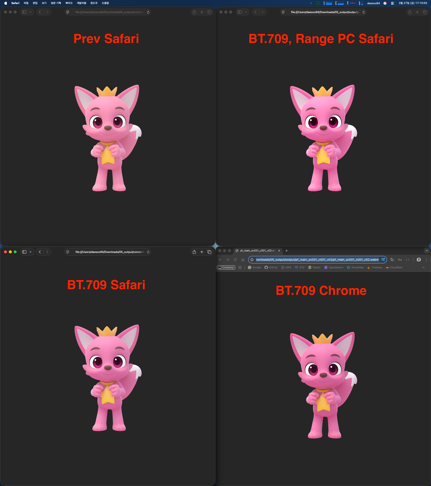
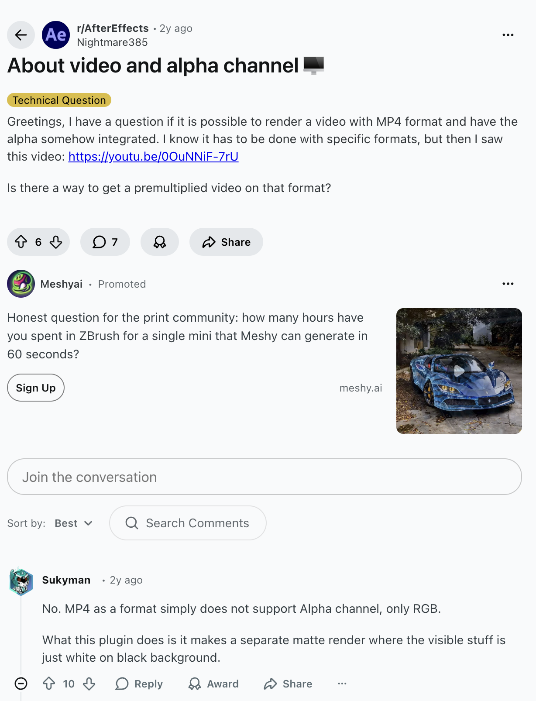
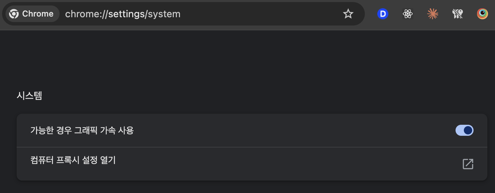
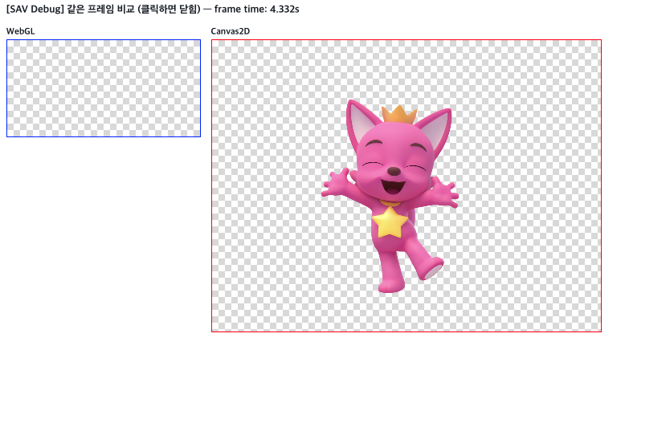
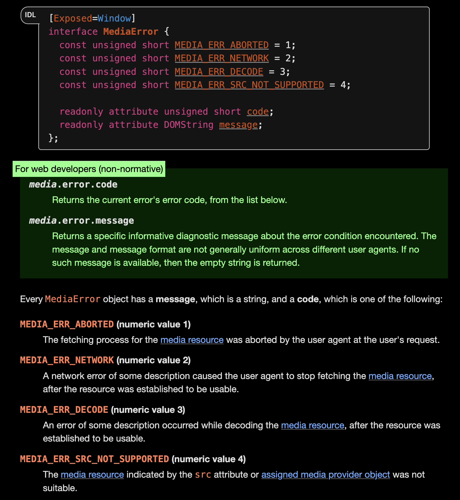
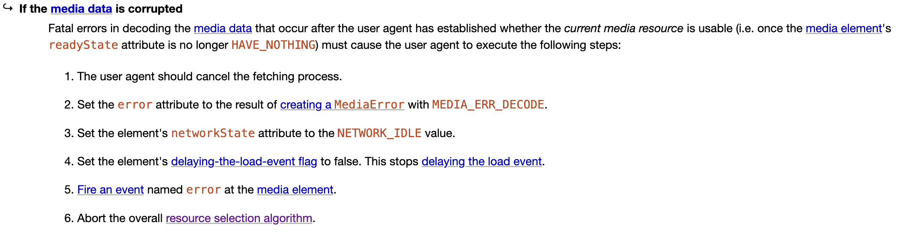
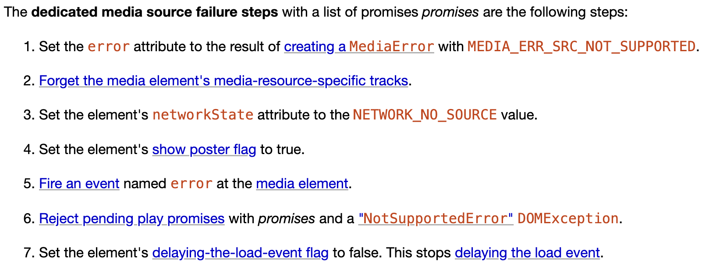

저희 팀에서는 최근 핑크퐁 닷컴을 개발하면서 메인 페이지와 캐릭터 탭에 배경이 투명한 Alpha Channel GIF를 넣어야 하는 작업이 있었습니다. 문제는 해당 GIF들의 크기가 평균 65MB에 달했다는 점인데요.

캐릭터를 담당했던 부서와 협의하여 화질을 낮추는 방안을 고려했지만, 담당 부서로부터 최대한 유지해줬으면 좋겠다는 답변을 받았습니다.

화질을 유지해야 한다는 요건 아래, 이전에 기능을 담당하셨던 분과 함께 aPNG, AVIF 등 여러 포맷을 검토했으나, 결국 `<video>` 태그로 컨버팅해 WebM(VP9)과 MOV(H.265) 두 가지 영상을 준비해 Chrome과 Safari 각각에 붙였습니다.

그러나 QA 과정에서 같은 영상인데 Chrome과 Safari에서 색이 다르게 보이는 문제가 터졌습니다.

이 문제를 맡아 고민하던 중, [최근에 썼던 글](/blog/alpha-channel-with-codecs/)의 영감을 바탕으로 한계들을 하나씩 풀어나갔습니다.

## 1. 최적화의 첫 걸음: 색상 공간과 컨테이너 통일

색상이 다른 원인은 크게 두 가지로 판단했습니다. 하나는 브라우저별 디코딩·컬러 매니지먼트 차이이고, 다른 하나는 컨테이너가 WebM과 MOV 두 개로 나뉘어 있다는 점이었습니다.

그래서 FFmpeg으로 영상을 분석해봤습니다.

> [FFmpeg](https://ffmpeg.org/)은 인코딩, 디코딩, 트랜스코딩, 먹싱, 스트리밍, 필터링, 재생까지 거의 모든 멀티미디어 처리를 다룰 수 있는 완벽한 크로스플랫폼 솔루션입니다.
>
> "A complete, cross-platform solution to record, convert and stream audio and video."

분석 결과, Alpha Channel이 들어간 영상 내부에 제대로 된 색상 공간이 지정되어 있지 않았습니다. [영상에 색상 공간 메타데이터가 없으면 브라우저마다 기본 가정이 달라지기 때문에](https://www.mux.com/blog/your-browser-and-my-browser-see-different-colors) 색상 공간을 명시적으로 지정했습니다.

FFmpeg으로 BT.709 색상 공간을 지정하였으나, 여전히 색상 차이가 컸습니다.


<div class="caption">BT.709 색상 공간을 지정했지만 여전히 색상 차이가 존재</div>

결국 같은 BT.709 태그를 달아도 Chrome에서는 WebM, Safari에서는 MOV를 보여주는 구조 자체가 문제였습니다. 컨테이너가 다르면 디코더와 컬러 파이프라인이 달라지기 때문에, 단일 컨테이너로 통일해야 한다는 결론에 도달했습니다. 그 과정에서 브라우저 호환성이 가장 넓은 컨테이너는 현실적으로 MP4라고 생각했습니다.

그런데 [MP4는 Alpha Channel을 기본 지원하지 않아](https://www.reddit.com/r/AfterEffects/comments/195z87f/about_video_and_alpha_channel/) 난관에 봉착했습니다.


<div class="caption">MP4는 Alpha Channel을 지원하지 않는다 (출처: Reddit)</div>

이때 [이전에 정리했던 Stacked Alpha Video 방식](/blog/alpha-channel-with-codecs/)이 떠올랐습니다. 영상에 알파를 직접 넣는 대신, 컬러와 알파를 한 프레임에 상하로 나란히 담아두고 WebGL·Canvas로 렌더링 시점에 합성하여 투명도를 재구성하는 방식이죠.

최종적으로 컨테이너는 MP4로 통일하되, 코덱은 압축률이 좋은 AV1과 HEVC를 사용하여 최적화를 해보기로 결정했습니다.

## 2. 라이브러리를 버리고 직접 구현한 이유

처음에는 [이전에 참조했었던 글](https://jakearchibald.com/2024/video-with-transparency/)에서 만든 [`stacked-alpha-video`](https://www.npmjs.com/package/stacked-alpha-video) 라이브러리를 그대로 가져다 쓰는 방향을 시도했습니다. 그러나 실제 프로젝트에 붙이는 순간 여러 문제가 드러났습니다.

먼저 SSR 환경에서 모듈 평가 단계부터 터졌습니다. 라이브러리가 모듈 최상단에서 `customElements.define(...)`을 즉시 실행하는 구조라, `import`되는 순간 `window`, `document`, `HTMLElement`를 건드리게 됩니다. 그래서 서버 사이드에서는 이 전역 객체들이 없으니 빌드와 런타임 모두 실패했습니다.

번들러 쪽 문제도 있었습니다. 패키지가 `"type": "module"` + `exports` 필드로 `./build/index.js`를 노출하는 구조인데, Turbopack이 이 경로를 제대로 해석하지 못해 `"module not found"` 에러가 재현되었습니다.

React JSX 타입도 제공되지 않았습니다. 라이브러리가 `HTMLElementTagNameMap`에만 태그를 등록하고 React JSX `IntrinsicElements`에는 등록하지 않아서, JSX에서 쓰면 TypeScript가 인식하지 못합니다. 프로젝트 내부에 별도 `.d.ts`를 수동으로 작성해야 했습니다.

마지막으로 SSR 하이드레이션 타이밍에서 검은 깜빡임이 발생했습니다. 커스텀 엘리먼트 정의가 클라이언트에서 뒤늦게 등록되다 보니, 영상이 마운트되기 전까지 검은 영역이 노출되었습니다.

이 정도면 라이브러리를 억지로 맞춰 쓰기보다 직접 구현하는 편이 낫겠다고 판단했습니다.

## 3. WebGL과 Canvas로 직접 구현하기

기본 아이디어는 기존 라이브러리의 로직을 그대로 가져왔습니다. 하나의 MP4 영상 안에 상반부는 컬러(RGB), 하반부는 알파(투명도) 정보를 담아두고, 렌더링 시점에 이 두 영역을 합성하여 투명 배경을 구현하였습니다.

```glsl
void main() {
  // 상반부(0.0~0.5): 컬러 영역
  vec2 colorCoord = vec2(v_texCoord.x, v_texCoord.y * 0.5);
  // 하반부(0.5~1.0): 알파 영역
  vec2 alphaCoord = vec2(v_texCoord.x, 0.5 + v_texCoord.y * 0.5);

  vec4 color = texture2D(u_frame, colorCoord);
  float alpha = texture2D(u_frame, alphaCoord).r;  // R채널만 읽기

  // Premultiplied Alpha로 출력
  gl_FragColor = vec4(color.rgb * alpha, alpha);
}
```

직접 구현을 하게 되면서 앞서 겪었던 라이브러리 문제들이 자연스럽게 해소되었습니다. 모든 DOM 조작을 `useEffect` 내부에서만 처리하니 SSR 문제를 해결했고, 외부 패키지 의존성을 완전히 제거하면서 Turbopack 호환성 문제도 사라졌습니다. 또한 커스텀 엘리먼트 대신 일반 React 컴포넌트로 만들게 되어서 별도 `.d.ts`파일도 필요가 없게 되었습니다.

한 가지 신경 쓰인 부분은 GPU 부하였습니다. WebGL로 렌더링한다는 건 결국 GPU를 쓴다는 뜻이니까요. Intersection Observer를 활용하여 뷰포트 밖에 있을 때는 렌더링을 중지시켰습니다.

```js
this.observer = new IntersectionObserver(([entry]) => {
  this.updateState({
    intersecting: entry.isIntersecting,
    videoPlaying: videoIsPlaying(this.video),
  });
});
```

화면에 보이지 않을 때는 비디오 재생을 중지하고 Canvas 메모리를 해제하여 불필요한 GPU 사용을 방지했습니다.

최종적으로 용량은 다음과 같이 줄어들었습니다.

|    단계    | 용량  |              방식               |
| :--------: | :---: | :-----------------------------: |
|  원본 GIF  | 65MB  |        Alpha Channel GIF        |
|  1차 변환  | 1.2MB | WebM(VP9) + MOV(H.265) 영상 2개 |
| 2차 최적화 | 268KB |     단일 MP4, AV1/HEVC 코덱     |

65MB에서 268KB로, 99.6% 감소. 단일 컨테이너 통일로 색상 불일치 문제도 함께 해결됐습니다.

## 4. 호환성 지옥과 세 가지 병목

직접 구현을 통해 용량과 성능을 잡았다고 생각했지만, 배포 이후가 진짜 시작이었습니다. Sentry 로그에서 여러 구간의 알람이 터지기 시작했어요.

### 이슈 1: 하드웨어 가속 미지원 (Canvas 2D Fallback)

가장 먼저 마주한 이슈는 Chrome에서 하드웨어 가속을 끈 환경이었습니다. 항상 최신 장비로 개발하다 보니 놓치기 쉬운 부분이었는데, 하드웨어 가속이 꺼져 있으면 WebGL Context 자체를 생성할 수 없습니다.


<div class="caption">Chrome 설정 > 시스템 > 가능한 경우 그래픽 가속 사용</div>

이를 대비해 Canvas 2D로 CPU 렌더링하는 Fallback 로직을 추가했습니다.

```js
// Uint32Array 비트 연산으로 알파 채널 합성
// Little-endian: 바이트 순서 R,G,B,A → Uint32 내 비트 배치 0xAABBGGRR
const d = new Uint32Array(fullData.data.buffer);
const pixelsPerHalf = width * halfHeight;

for (let i = 0; i < pixelsPerHalf; i++) {
  // 상반부 픽셀의 A채널에 하반부 픽셀의 R값을 대입
  d[i] = (d[i] & 0x00ffffff) | ((d[i + pixelsPerHalf] & 0xff) << 24);
}
```

Uint32Array 비트 연산으로 픽셀 데이터를 직접 처리하는 방식 덕분에, 하드웨어 가속이 꺼지거나 GPU를 쓸 수 없는 환경에서도 재생이 가능해졌습니다.


<div class="caption">하드웨어 가속이 꺼진 환경에서 WebGL(좌)과 Canvas 2D Fallback(우) 비교</div>

### 이슈 2: 발열과 WebGL Context 과점유

첫 번째 문제를 해결하고 안도할 무렵, 저사양 기기를 대여받아 직접 써보니 발열과 렉이 체감될 정도로 심각했습니다. 세 가지 이슈 중 이 문제가 가장 까다로웠어요.

<video src="./gl_context.mov" autoplay loop muted playsinline style="width: 100%; display: block; margin: 0 auto; border-radius: 0;"></video>

<div class="caption">저사양 기기에서 WebGL Context 과다 생성으로 인한 렉 현상</div>

원인을 파보니, 처음에 각 캐릭터 카드마다 WebGL Context를 개별로 생성·파괴하고 있었던 게 문제였습니다. 브라우저별로 WebGL Context 수에 제한이 있어서, 캐릭터가 많아질수록 Context가 한도에 도달하거나 GPU 메모리를 과점유하고 있었습니다.

그래서 WebGL Context를 카드마다 따로 만드는 대신, 하나만 만들어서 전부 돌려쓰는 방식으로 바꿨습니다. 즉 하나의 공유 Offscreen Canvas에서 렌더링한 결과를 각자의 Canvas에 `drawImage`로 복사하는 구조로 변경하였습니다.

추가로 현재 활성화된 메인 카드 1개만 WebGL 렌더링을 수행하고, 나머지 카드는 FFmpeg으로 추출한 첫 프레임 썸네일로 대체하여 GPU 부하를 최소화했습니다.

<video src="./gl_context_after.mov" autoplay loop muted playsinline style="width: 100%; display: block; margin: 0 auto; border-radius: 0;"></video>

<div class="caption">WebGL Context 공유 적용 후 저사양 기기에서의 렌더링 개선</div>

### 이슈 3: 디코딩 실패(code 3)와 스펙의 한계

세 번째 문제는 Sentry에서 처음 보는 기기들이 `MediaError.code` 3을 뱉어대기 시작한 것이었어요. `<source>` 태그에 AV1, HEVC 순서로 넣어뒀으니 의례적으로 AV1이 안 되면 HEVC로 넘어갈 줄 알았는데, AV1 영상에서 그냥 뻗어버리고 다음 소스로 넘어가질 않았습니다.


<div class="caption">MediaError 인터페이스 (출처: HTML Spec)</div>

> - **code 1** (`MEDIA_ERR_ABORTED`): 사용자가 직접 미디어 로딩을 중단한 경우
> - **code 2** (`MEDIA_ERR_NETWORK`): 네트워크 에러로 다운로드가 실패한 경우
> - **code 3** (`MEDIA_ERR_DECODE`): 리소스를 가져왔지만 디코딩에 실패한 경우
> - **code 4** (`MEDIA_ERR_SRC_NOT_SUPPORTED`): 미디어 리소스 자체가 적합하지 않은 경우

[HTML 스펙의 리소스 선택 알고리즘](https://html.spec.whatwg.org/multipage/media.html#concept-media-load-algorithm)을 찾아보니 이유가 있었습니다. `<source>` 태그의 자동 폴백은 source를 선택하는 단계에서 "이 타입은 재생 못 하겠다"고 판단될 때(`MEDIA_ERR_SRC_NOT_SUPPORTED`, code 4) 동작합니다. 반면 code 3(`MEDIA_ERR_DECODE`)은 브라우저가 소스를 선택한 뒤 실제로 디코딩을 시도하다가 터지는 거라, 리소스 선택 알고리즘 밖에서 발생합니다. 즉 브라우저 입장에서는 이미 소스를 골랐기 때문에 다음 `<source>`로 넘어갈 이유가 없는 거죠.


<div class="caption">code 3(MEDIA_ERR_DECODE) — 디코딩 실패 시 다음 source로 넘어가지 않는다</div>


<div class="caption">code 4(MEDIA_ERR_SRC_NOT_SUPPORTED) — 포맷 미지원 시 자동으로 다음 source를 시도한다</div>

결론적으로, HTML 스펙상 런타임 디코딩 에러는 자동 폴백이 지원되지 않으므로 자바스크립트 단에서 `onerror` 이벤트를 캐치해 수동으로 다른 소스를 넘겨주는 방식을 적용했습니다.

## 5. 마무리하며

65MB의 GIF를 사용해야 했던 무거운 페이지가 단일 MP4 파일 시도와 WebGL 오프로드를 거쳐 268KB로 줄일 수 있었습니다. 이 과정에서 용량 최적화라는 첫 목표를 수치로도 명확히 달성할 수 있었고요.

그 과정에서 마주친 세 가지 호환성 이슈는 각기 원인이 달랐고, 덕분에 Fallback도 각각 다른 방식으로 적용해야 했습니다.

처음부터 이걸 다 알고 시작한 건 아니었습니다. 지표에서 이상을 발견하고, 스펙 문서를 뒤지고, 설정을 바꿔보는 과정을 반복하다 보니 이 지점까지 오게 됐습니다. 특히 `MEDIA_ERR_DECODE`가 왜 자동 폴백이 안 되는지는 스펙을 직접 읽기 전까진 전혀 예상하지 못했던 부분이었습니다.

이번 작업을 통해 새로운 기술을 도입할 땐 호환성을 매번 의심해야 한다는 걸 다시금 느꼈습니다. 아무리 좋은 기술이어도 사용자가 서비스를 이용하지 못하면 무용지물이니까요. 긴 글 읽어주셔서 감사합니다.

## Reference

- [Video with transparency - Jake Archibald](https://jakearchibald.com/2024/video-with-transparency/)
- [stacked-alpha-video - NPM](https://www.npmjs.com/package/stacked-alpha-video)
- [Alpha transparency in Chrome video](https://developer.chrome.com/blog/alpha-transparency-in-chrome-video?hl=ko)
- [Your browser and my browser see different colors - Mux](https://www.mux.com/blog/your-browser-and-my-browser-see-different-colors)
- [WebGLRenderingContext - MDN](https://developer.mozilla.org/en-US/docs/Web/API/WebGLRenderingContext)
- [WebGL 기초 정리](https://blog.naver.com/istarkmh/223239829761)
- [Media error codes - HTML Spec](https://html.spec.whatwg.org/multipage/media.html#error-codes)
- [AV1 브라우저 지원 현황 - Can I Use](https://caniuse.com/av1)
- [HEVC 브라우저 지원 현황 - Can I Use](https://caniuse.com/hevc)
- [AV1 vs H.264 vs H.265 - FastPix](https://www.fastpix.io/blog/av1-vs-h-264-vs-h-265-best-codec-for-video-streaming)
- [HTMLMediaElement.readyState - MDN](https://developer.mozilla.org/ko/docs/Web/API/HTMLMediaElement/readyState)
- [HTMLMediaElement.networkState - MDN](https://developer.mozilla.org/ko/docs/Web/API/HTMLMediaElement/networkState)
- [문제의 원인을 Safari에서 찾으면 대부분 맞다? (feat. Alpha Channel)](/blog/alpha-channel-with-codecs/)
