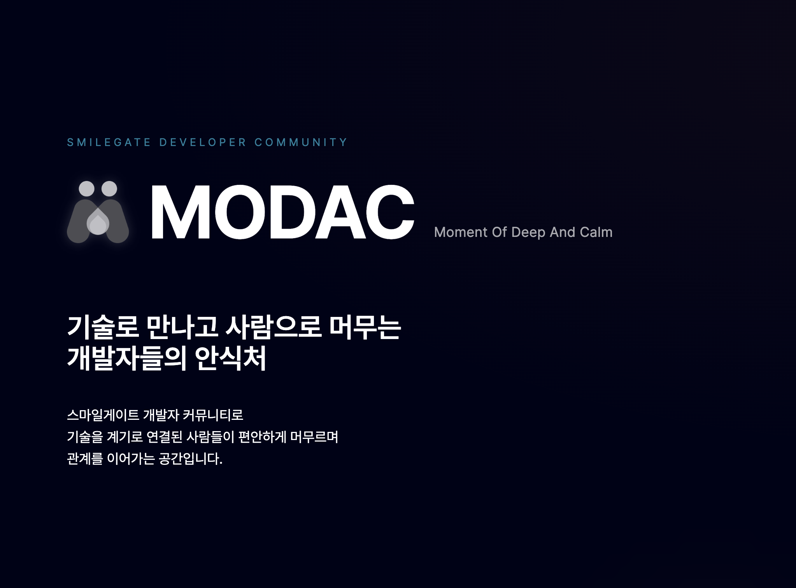
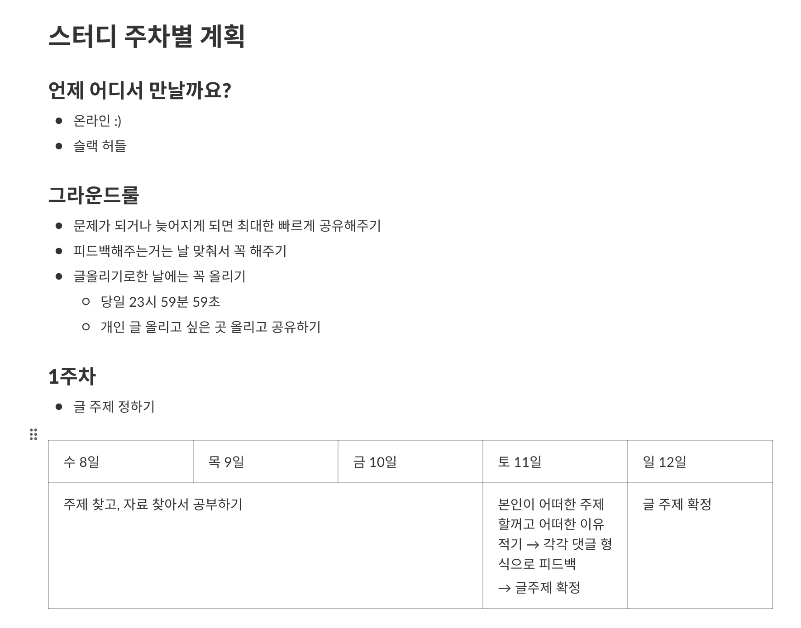
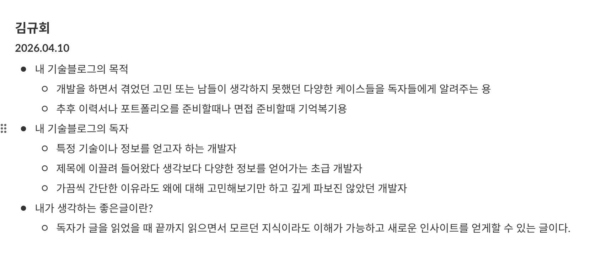

개발을 하다 보면 기술 블로그에 글을 쓰고 싶다는 생각이 자주 듭니다. 그런데 막상 쓰려고 하면 손이 잘 안 가고, 써도 뭔가 아쉬운 느낌이 남습니다. 이 정도 퀄리티면 올려도 되나 싶은 의문이 매번 따라붙죠.

그러다 마침 스마일게이트 개발 커뮤니티가 Modac으로 새롭게 리브랜딩하면서 모닥랩이라는 스터디 프로그램을 운영하게 됐습니다. 다 같이 글을 써보고 피드백을 주고받는 스터디를 해보면 어떨까 싶어서 **모닥글**이라는 기술 블로그 스터디를 직접 호스트하게 됐고, 약 한 달간 글 두 편을 쓰며 피드백을 받는 경험을 했습니다.

MODAC — 스마일게이트 개발자 커뮤니티

짧지만 밀도 있었던 이 경험을 회고해보려 합니다.

## 모닥글이 무엇인가요?

모닥글은 Modac 랩에서 진행한 온라인 기술 블로그 스터디로, 약 5주간 매주 정해진 일정에 따라 주제 선정부터 글 게시까지 진행했습니다.

모닥글 스터디 주차별 계획 — 글 게시일에는 반드시 올리는 게 원칙

스터디 팀원분들과 함께 정한 그라운드 룰 중 두 가지가 특히 마음에 들었습니다.

- **피드백은 날 맞춰서 꼭 해주기**: 단순히 글을 쓰는 게 아니라 서로의 글을 읽고 의견을 나누는 게 핵심이었습니다.
- **글 올리기로 한 날에는 꼭 올리기**: 당일 23시 59분 59초까지. 이 마감이 생각보다 큰 동기부여가 됐습니다.

## 시작 전에 스스로에게 던진 질문

스터디 첫 주차에 각자 자신의 블로그 방향을 정리해서 공유했습니다. 내가 생각하는 좋은 글이란 무엇인가라는 질문을 스스로에게 먼저 던져야 했습니다.

2026.04.10 기준으로 정리한 내 블로그의 목적, 독자, 좋은 글의 정의

늘 막연히 고민해왔는데, 막상 글로 정의해보려 하니 생각보다 쉽지 않았습니다. 그 어려움을 마주하면서 작년 12월부터 왜 글을 써왔는지를 다시 곱씹게 됐고, 결국 이런 정의가 나왔습니다.

> 독자가 글을 읽었을 때 끝까지 읽으면서, 모르던 지식이라도 이해가 가능하고 새로운 인사이트를 얻게 할 수 있는 글

글을 쓰다 방향이 흔들릴 때 이 문장이 나침반 역할을 해줬습니다.

## 첫 번째 글: [Alpha Channel GIF 최적화 경험기](/blog/gif-optimization/)

### 쓰게 된 계기

첫 글 주제는 스터디를 만들 때부터 마음속으로 정해두고 있었습니다. 업무에서 65MB짜리 Alpha Channel GIF를 다뤄야 했고, 이를 268KB까지 줄이면서 색상 불일치, WebGL 렌더링, 호환성 이슈들을 하나씩 풀어나갔던 경험이 생생하게 남아 있었거든요.

`MEDIA_ERR_DECODE`가 왜 자동 폴백이 안 되는지 HTML 스펙을 직접 읽고서야 이해했던 순간이 있었고, 그 과정에서 느꼈던 몰입감을 누군가와 나눠보고 싶었습니다.

### 고민했던 점

제일 고민했던 건 전제 지식의 범위였습니다. WebGL이나 Canvas 2D에 익숙하지 않은 독자도 읽을 수 있어야 한다고 생각했기 때문에, 코드를 넣을 때 설명을 어디까지 붙여야 할지 계속 고민했습니다.

결국 코드 자체보다는 왜 이 방법을 선택했는지, 이슈를 만났을 때 어떻게 원인을 찾았는지의 흐름에 집중하는 방향으로 썼습니다.

### 받은 피드백

트러블슈팅 흐름과 시각 자료 구성이 좋았다는 긍정적인 반응도 있었지만, 아쉬운 피드백도 분명했습니다.

- **용어 진입 장벽**: WebGL, Stacked Alpha, fMP4 같은 용어들이 해당 도메인을 잘 모르는 독자에게는 낯설게 느껴진다는 피드백이 있었습니다. 용어를 쉽게 풀어주면 더 많은 사람이 읽을 수 있을 것 같다는 말이 꽤 와닿았습니다.
- **독자 타겟 명시 필요**: 글 앞단에 어떤 배경 지식이 필요한지, 어떤 상황의 사람을 위한 글인지를 미리 적어주면 좋겠다는 의견이 있었습니다. 첫 문장부터 문제 상황으로 뛰어들다 보니, 독자가 자신과 연관된 글인지 판단하기 어려웠던 것 같습니다.
- **서두 요약 부재**: 긴 글을 읽기 전에 전체 맥락을 파악할 수 있는 요약이 있으면 좋겠다는 피드백도 있었습니다. 요즘은 글을 AI로 요약해서 먼저 훑어보는 경우도 많은 만큼, 서두에 요약이 있으면 정독할지 결정하기 쉽다는 이야기가 인상적이었습니다.

결국 내용보다 먼저, 독자가 이 글이 자신과 관련 있는지 판단할 여지를 주지 않았던 게 문제였습니다.

## 두 번째 글: [우리는 왜 스트리밍 플레이어를 사용할까?](/blog/video/)

### 쓰게 된 계기

첫 글을 쓰고 나서 다음엔 좀 더 넓은 독자를 대상으로 써보고 싶다는 생각이 생겼습니다. 첫 글이 실무에서 겪은 특정 문제를 깊이 파고드는 형태였다면, 두 번째는 단순해 보이는 것을 왜라는 질문 하나로 끝까지 따라가보는 경험을 나눠보고 싶었습니다.

그래서 고른 주제가 스트리밍 플레이어였습니다. shaka-player에 꾸준히 기여하면서, 그리고 회사에서 직접 다루면서, `<video>` 태그 하나만으로는 부족한 게 너무 많다는 걸 몸으로 느껴왔거든요. 그런데 왜 스트리밍 플레이어가 필요하고 뒤에서 어떤 일이 일어나는지를 차근차근 풀어주는 글이 생각보다 없었습니다.

### 고민했던 점

이 글의 가장 큰 도전은 분량 조절이었습니다. HLS, DASH, MSE처럼 낯선 용어들을 하나씩 풀어나가다 보면 글이 자연스럽게 길어지는데, 그 길이가 독자 입장에서 부담스럽지 않을지 계속 신경 쓰였습니다.

대상 독자를 `<video>` 태그를 한두 번 써봤지만 그 뒤는 잘 모르는 분으로 잡았기 때문에, 기술 깊이와 접근성 사이의 균형이 쉽지 않았습니다. HLS master playlist나 DASH MPD XML은 맥락을 따라가려면 결국 피할 수 없는 내용이라, 최대한 이미지와 함께 충분한 설명을 붙이는 데 공을 들였습니다.

### 받은 피드백

첫 글보다 완독률이 올라갔고, FE, 서버, 게임 등 영상 도메인과 거리가 있는 직군들도 끝까지 읽어줬다는 게 개인적으로 가장 뿌듯했습니다.

그럼에도 아쉬운 피드백도 분명하게 왔습니다.

- **중간 요약의 부재**: HLS, DASH, MSE가 순서대로 쏟아지다 보니, 흐름은 따라가는데 지금까지 뭘 배웠는지 중간 점검이 없어서 독자가 지쳐간다는 의견이 여럿 있었습니다. 짧은 요약 박스 하나가 중간에 몇 번 들어갔다면 달라졌을 것 같습니다.
- **용어의 산발적 등장**: 시킹, MSE 같은 용어가 설명 없이 먼저 등장하는 경우가 있다는 피드백이 있었습니다. 용어를 처음 쓸 때 바로 설명을 붙이거나, 각주처럼 호버로 띄울 수 있는 형태가 있었으면 좋겠다는 제안도 있었습니다.
- **일부 설명의 과잉**: 핵심 메시지가 반복되는 구간이 있고, 문제 목록이 예상보다 길어서 흐름을 따라가기보다 스크롤을 먼저 내리게 됐다는 이야기도 있었습니다. 정말 어려운 부분에만 설명을 집중하고 나머지는 압축하는 편이 좋았을 것 같다는 반성이 됐습니다.
- **URL이 너무 generic**: `/video/`라는 경로가 글의 주제를 충분히 드러내지 못한다는 피드백도 있었습니다. SEO 측면에서도 아쉬운 부분이었고, 이건 다음 글을 쓸 때 바로 반영할 수 있는 간단한 개선이었습니다.

완독은 올라갔지만 이해 용이성은 첫 글과 똑같이 반복된 숙제였습니다. 독자가 끝까지 읽게 만드는 것과, 끝까지 읽으면서 이해하게 만드는 것은 다른 문제라는 걸 다시 느꼈습니다.

## 스터디를 마치며

이번 스터디에서 가장 크게 느낀 건, 내가 아는 걸 누군가에게 쉽게 풀어서 설명하는 일이 정말 어렵다는 것입니다.

혼자 쓸 때는 이 정도면 이해하기 쉽겠지 싶어도, 막상 피드백을 받아보면 독자 입장에서 당연하지 않은 부분이 꼭 있었습니다. 글도 결국 개발에 비유하자면 UX가 아닐까 싶었습니다. 코드가 아무리 잘 짜여 있어도 쓰기 불편하면 의미가 없듯, 글도 독자가 끝까지 읽을 수 있어야 비로소 완성된다는 생각이 들었습니다.

다른 사람의 글을 읽으면서도 배움이 있었습니다. 같은 기술 주제라도 독자를 어디에 놓느냐에 따라 글의 결이 완전히 달라진다는 걸, 피드백을 주고받으면서 직접 체감할 수 있었습니다.

처음에 정의했던 독자가 끝까지 읽으면서 새로운 인사이트를 얻는 글이라는 기준에 내가 쓴 글이 얼마나 닿았는지는 솔직히 아직 모르겠습니다. 다만 그 기준을 한 번에 완벽히 달성해버리면 오히려 글을 계속 쓸 이유가 사라질 것 같다는 생각도 들었습니다. 아직 닿지 못한 목표이기 때문에, 그 목표에 닿았을 때 어떤 기분일지 궁금해하며 계속 쓰게 되는 게 아닐까요.
