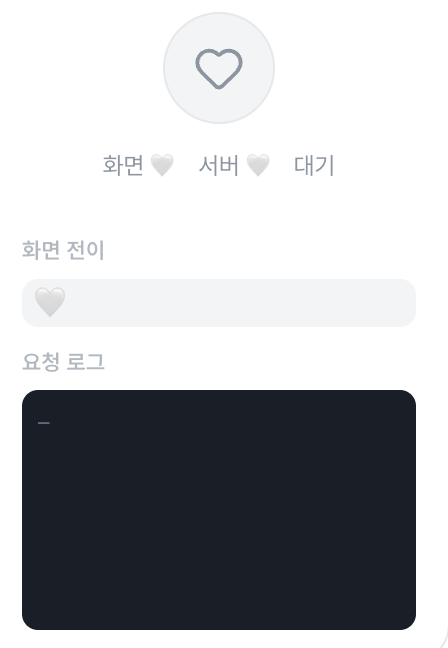
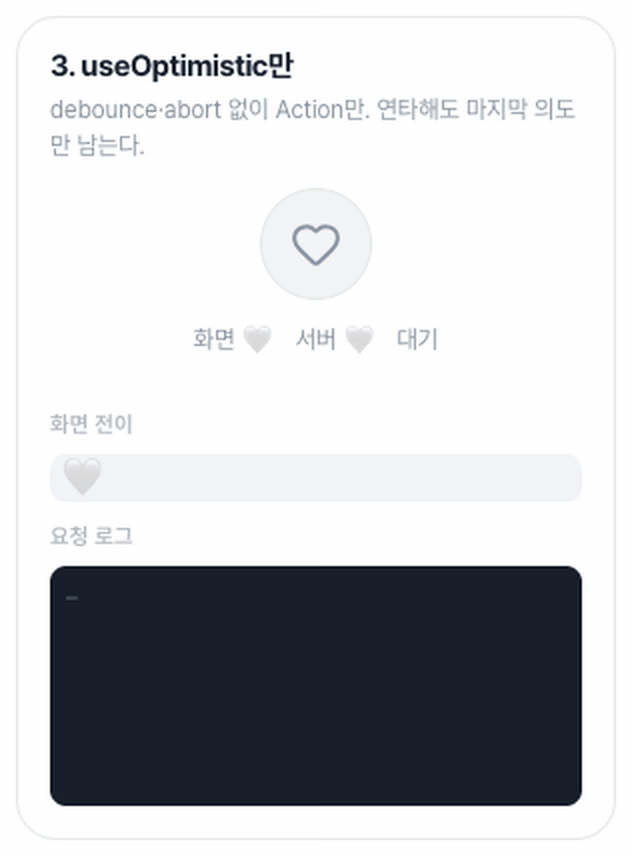
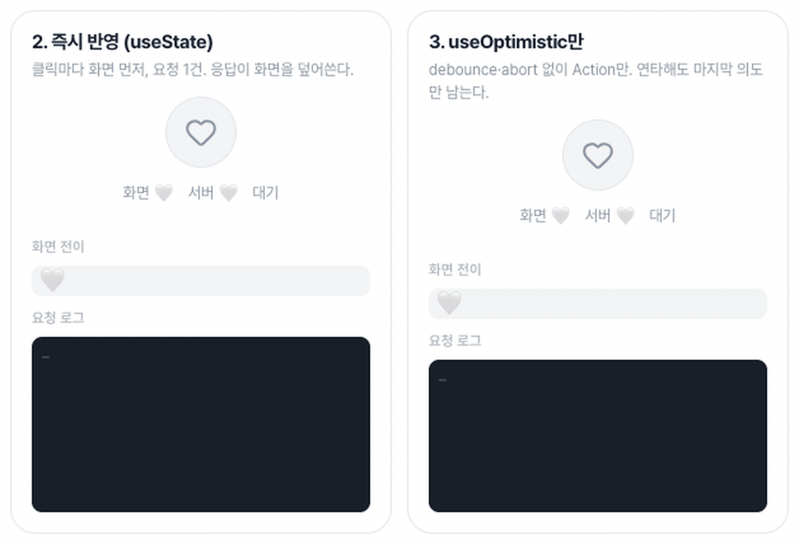
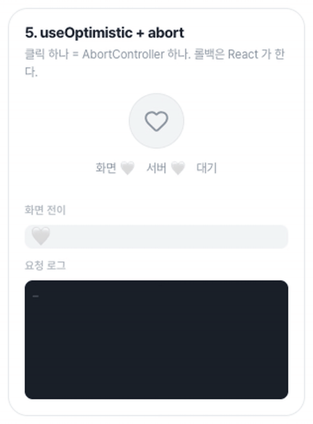
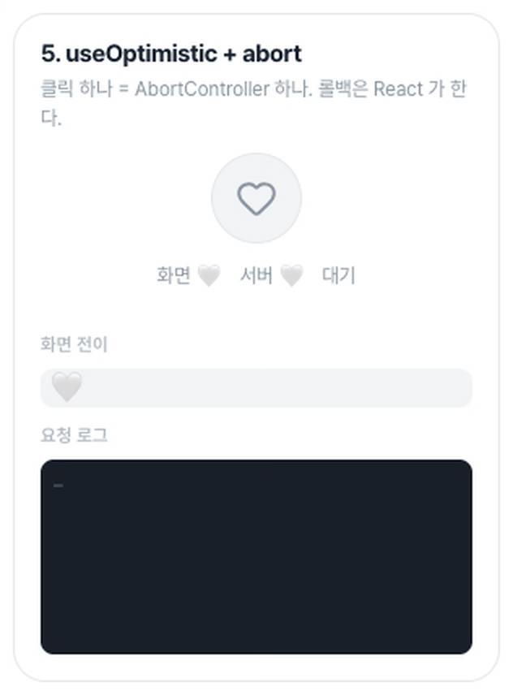

요즘 스토어 개편 작업을 맡아 개발하고 있는데요! 그런데 상품 카드의 찜 하트를 누를 때마다 뭔가 답답했습니다. 누르면 버튼이 회색으로 잠기고, 한참 뒤에야 하트가 채워집니다. 못 기다릴 정도는 아닙니다. 하지만 참을성 없는 한국인으로서, 그리고 제가 사용자라고 생각한다면 서버 응답을 기다릴때까지 UI가 기다린다는 구조 자체가 정말 불편하게 느껴졌습니다.

그래서 이 글에서는 React 19의 `useOptimistic`과 `startTransition`으로 찜 버튼을 누르는 즉시 반응하게 바꾸면서, 연타와 요청 취소, 실패했을 때의 롤백까지 어떻게 처리했는지 정리해 보려고 합니다.

## 시작점: 왜 답답했나

처음에는 정말 단순하게 state를 활용한 코드를 짰었습니다. 그러다보니 응답을 기다려야 state가 반영이 되었습니다. 여기서 문제점은 서버 지연 속도가 느리게 된다면 사용자는 찜을 위해 여러번 기다려야하는것입니다. 그렇게 되면 사용자 입장에서는 찜을 했다가 취소할수도있는데 서버를 위해 기다려야된다는 불편한 점을 느낄수도 있겠다는 생각을 했습니다.


<div class="caption">서버 응답이 올 때까지 하트가 바뀌지 않는 차단형 찜 버튼</div>

## 그래서 사용자가 편하려면?

그래서 저는 찜을 불편함 없이 쓰려면 사용자는 서버 사정을 몰라야 한다고 정의하기로 했습니다. 눌렀으면 눌린 것이고, 그 뒤처리는 코드가 알아서 해야 한다고 생각합니다. 그렇게 정하고 나니 고민이 줄줄이 따라왔습니다.

1. 서버 응답과 관계없이 화면부터 바꾸려면 — 낙관적 UI를 어떻게 적용할 것인가
2. 그러면 연타했을 때 서버 요청은 어떻게 관리할 것인가
3. 요청이 아직 진행 중인데 사용자가 다시 누르면 어떻게 할 것인가
4. 낙관적으로 바꿔놨는데 서버가 실패하면 어떻게 되돌릴 것인가
5. 만약 낙관적 UI로 상태가 서버보다 앞서가게 될텐데 어긋난 요청을 어떻게 관리할 것인가?

이 상황들을 순서대로 따라가 보니 결국 서버에서 나오는 응답 값과 지금 화면에 보여 줄 값을 따로 들고 있어야 하고, 요청이 진행 중인 구간이 언제 시작해서 언제 끝나는지 알아야 했습니다. 그 지점에서 떠오른 부분이 `useOptimistic`과 `startTransition`이었습니다.

## 그냥 useState로 하면 안 될까?

`useOptimistic`을 적용해보기 전에 의문점이 하나 들수도 있습니다. 낙관적 UI라고 해 봐야 화면 먼저 바꾸고, 실패하면 되돌리면되는데 `useState` 쓰면 되지 않을까? 실제로 가장 먼저 떠올리기 쉬운 코드는 아래와 같습니다.

```tsx
const [shown, setShown] = useState(false);

const toggle = () => {
  const next = !shown;
  setShown(next); // 화면 먼저

  server
    .set(next)
    .then(() => setShown(next)) // 성공하면 확정
    .catch(() => setShown(!next)); // 실패하면 반대로 되돌리기
};
```

한 번만 누르게 되면 동작은 합니다. 하지만 그렇게 되면 아래처럼 몇가지 문제점이 생깁니다.

### 응답이 화면을 덮어쓰임

찜을 누르고 곧바로 해제를 누르면 `POST`와 `DELETE` 요청이 동시에 떠 있게 되고, 화면의 하트는 마지막 클릭대로 비어 있어야합니다. 문제는 각 요청에 묶인 `.then`이 응답이 도착하는 순서대로 화면을 덮어쓴다는 점입니다.

`POST` 응답이 먼저 오면, 이미 지나간 찜 클릭의 `setShown(true)`가 하트를 다시 채웠다가 `DELETE` 응답이 와서야 비웁니다. 사용자 눈에는 하트가 혼자 깜빡이게 됩니다.

| 시간   | 일어난 일   | 처리              | 화면                               |
| ------ | ----------- | ----------------- | ---------------------------------- |
| 0ms    | 찜 클릭     | `POST` 전송       | 하트 채움                          |
| 100ms  | 해제 클릭   | `DELETE` 전송     | 하트 비움 (요청 2개가 동시에 진행) |
| 1200ms | POST 응답   | `setShown(true)`  | 하트가 다시 채워짐                 |
| 1300ms | DELETE 응답 | `setShown(false)` | 다시 비워짐                        |

### 두 요청이 실패한다면?

같은 상황에서 두 요청이 모두 실패했다고 해 볼게요. 각 요청은 자기 클릭 직전 값으로 되돌립니다. 찜 요청은 `setShown(!true)` = `false`, 해제 요청은 `setShown(!false)` = `true`입니다. 찜 요청이 롤백될 때는 하트가 이미 비어 있어 아무 변화가 없고, 마지막에 해제 요청이 롤백되면서 하트를 채운 채로 끝납니다. 서버에는 아무것도 반영되지 않았는데 화면에는 하트가 채워진 채로 남게됩니다.

| 시간   | 일어난 일   | 처리              | 화면                     |
| ------ | ----------- | ----------------- | ------------------------ |
| 0ms    | 찜 클릭     | `POST` 전송       | 하트 채움                |
| 100ms  | 해제 클릭   | `DELETE` 전송     | 하트 비움                |
| 1200ms | POST 실패   | `setShown(false)` | 이미 비어 있어 변화 없음 |
| 1300ms | DELETE 실패 | `setShown(true)`  | 하트가 채워진 채로 끝남  |

결국 문제는 직전 값이라고 생각한 것도 서버가 확인해 준 값이 아니라는 점입니다. 제대로 하려면 서버가 확인해 준 값을 따로 저장해 두고, 아직 안 끝난 요청이 몇 개인지 세다가, 전부 끝나면 그 값으로 화면을 맞춰야 합니다. 그렇다고 서버 응답에 맞춰서만 state를 바꾸면, 처음의 차단형 버튼처럼 응답이 올 때까지 화면이 멈춰 있는 구간이 다시 생깁니다. 이 두 가지 불편함을 대신 해결해 주는 게 `useOptimistic`과 `startTransition`입니다.

## useOptimistic이란?

`useOptimistic`은 비동기 작업이 대기 중인 동안 화면에 다른 상태를 보여 줄 수 있게 해 주는 Hook입니다. 사용법은 간단합니다.

```tsx
const [value, setValue] = useState(false); // 기준 상태: 서버가 확인해 준 값
const [shown, show] = useOptimistic(value); // 낙관적 상태: 화면에 보여 줄 값
```

여기서 두 상태의 역할이 다릅니다. `value`는 기준 state로, 서버가 성공했다고 응답했을 때만 바꾸는 실제 값입니다. `shown`은 낙관적 state로, 화면에 렌더링하는 값입니다. 서버 요청은 우리 코드가 보내고, `useState`는 그 결과를 담아 두기만 합니다.

대기 중인 낙관적 업데이트가 없으면 `shown`은 `value`와 같습니다. 찜 버튼을 눌러 `show(true)`를 호출하면 낙관적 업데이트가 하나 쌓이고, `value`는 `false` 그대로인 채 `shown`만 먼저 `true`가 됩니다. 기준 상태 위에 낙관적 업데이트를 잠깐 덧씌운다고 생각하면 쉽습니다.

찜 버튼을 한 번 눌렀을 때 두 상태는 이렇게 움직입니다.

| 시점        | 일어난 일              | `shown` | `value` |
| ----------- | ---------------------- | ------- | ------- |
| 클릭        | `show(true)`           | true    | false   |
| 응답 대기   | 서버 응답 기다림       | true    | false   |
| 응답 성공   | `setValue(true)`       | true    | true    |
| Action 완료 | 낙관적 업데이트 되돌림 | true    | true    |

여기서 `shown`이 다시 `value`를 따라가는 시점이 중요합니다. 응답이 성공해 `setValue(true)`를 호출하면 `value`는 바로 `true`가 되지만, 화면에 보이는 `shown`은 낙관적 업데이트가 덮고 있어서 계속 `true`입니다. 낙관적 업데이트는 Action이 완료될 때 되돌려지는데, 그때는 이미 `value`가 `true`라 `shown`도 그대로 `true`입니다. 그래서 값이 확정되는 순간에도 하트가 깜빡이지 않습니다.

요청이 실패하면 `setValue`를 호출하지 않으니 `value`는 계속 `false`로 남아 있습니다. Action이 완료되어 낙관적 업데이트가 되돌려지면 `shown`도 `false`가 되고, 하트는 원래대로 돌아갑니다. 성공이든 실패든 React는 낙관적 업데이트를 되돌리고 기준 상태를 보여 줄 뿐이라, 롤백 코드를 따로 작성할 필요가 없습니다.

이렇게 React가 낙관적 업데이트를 되돌리는 기준은 `show()`를 호출한 Action이 완료되는 시점입니다. 그래서 `show()`는 반드시 Action 안에서 호출해야 합니다. Action 밖에서 호출하면 언제 되돌릴지 기준이 없어서, 경고가 뜨고 낙관적 상태가 바로 사라집니다.

## startTransition이란?

그렇다면 Action은 어떻게 만들까요? 가장 기본적인 방법이 `startTransition`입니다.

`startTransition`은 넘긴 함수가 실행되는 동안 일어난 상태 업데이트를 우선순위가 낮은 업데이트, 즉 Transition으로 처리합니다. React 19부터는 여기에 `async` 함수도 넘길 수 있게 되었고, 이렇게 `startTransition`에 넘기는 함수를 Action이라고 부릅니다.

```tsx
startTransition(async () => {
  show(true); // Action 안에서 호출
  await server.set(true);
}); // 이 함수가 끝나면 Action 완료
```

앞에서 `useOptimistic`이 낙관적 업데이트를 되돌린다고 했던 때가 바로 이 함수가 끝나는 시점입니다.

`startTransition`만으로는 Action이 진행 중인지 알 수 없습니다. 진행 여부가 필요하다면 `useTransition`을 쓰면 됩니다. `useTransition`이 돌려주는 `startTransition`은 위와 똑같이 동작하고, 여기에 Action이 대기 중인지를 알려 주는 `isPending`이 함께 따라옵니다.

## 써 보면서 생긴 질문들

그러면 이때까지 `useOptimistic`, `startTransition`에 대해 알아봤는데요. 그러면 저렇게만 알면 충분한걸까요? 해당 부분을 공부를 하다보니 아래처럼 고민이 생기게 되었습니다.

- 실패하면 React는 어떻게 값을 되돌리는 걸까?
- 연타해서 Action이 겹치면 왜 깜빡이지 않을까?
- 요청이 진행 중일 때 다시 누르면, 이전 요청은 어떻게 될까?

문서만으로는 잘 와닿지 않아서, [Optimistic UI Lab](/playground/optimistic-ui/)에서 서버 지연과 실패를 조절해 가며 직접 눌러 보고 확인했습니다.

### React는 어떻게 되돌릴까?

Lab에서 실패 모드를 켜고 찜을 눌러 보면, 하트가 먼저 채워졌다가 서버 응답이 실패한 뒤 원래대로 돌아옵니다. 코드에는 롤백하는 줄이 한 줄도 없는데 말이죠.


<div class="caption">롤백 코드 없이 실패하면 하트가 원래대로 돌아온다</div>

이유는 React 내부 코드에서 찾을 수 있었습니다. 프로젝트에 설치된 `react-dom`의 개발용 빌드 파일을 열어 보면, `show()`를 호출했을 때 실행되는 `dispatchOptimisticSetState` 함수가 업데이트 객체를 하나 만들어 업데이트 큐에 쌓습니다. 같은 파일에서 일반 `setState`가 만드는 업데이트 객체와 나란히 놓고 보면 차이가 잘 보입니다.

```js
// node_modules/react-dom/cjs/react-dom-client.development.js

// 일반 setState → dispatchSetStateInternal
var update = {
  lane: lane, // 이벤트나 Transition에 따라 정해진 우선순위
  revertLane: 0, // 0 = 되돌리지 않음. 한 번 적용되면 계속 남는다
  gesture: null,
  action: action,
  hasEagerState: !1,
  eagerState: null,
  next: null,
};

// useOptimistic의 show() → dispatchOptimisticSetState
action = {
  lane: 2, // 항상 가장 높은 우선순위로 바로 렌더링
  revertLane: requestTransitionLane(), // 현재 Action의 우선순위. 이 렌더링이 오면 버려진다
  gesture: null, // 제스처 Transition용 실험 기능, 정식 버전에서는 항상 null
  action: action, // show()에 넘긴 값
  hasEagerState: !1, // 미리 계산한 결과가 있는지 (낙관적 업데이트는 항상 false)
  eagerState: null, // 미리 계산한 결과
  next: null, // 업데이트 큐에서 다음 업데이트를 가리킴
};
```

나머지 값은 같고 `lane`과 `revertLane`만 다릅니다. 일반 `setState`는 `revertLane`이 `0`이라 한 번 적용된 업데이트가 그대로 남습니다. 반면 낙관적 업데이트는 `lane`이 `2`라서 바로 화면에 보이고, `revertLane`에 Action의 Transition 우선순위가 들어가 있어서 그 Action이 끝나면 사라집니다.

실제로 업데이트를 버리는 부분은 같은 파일의 `updateReducerImpl` 함수에 있습니다.

```js
// node_modules/react-dom/cjs/react-dom-client.development.js
// updateReducerImpl (react-dom 19.3.0, 일부 생략)
var revertLane = update.revertLane;

if (0 === revertLane) {
  // 일반 setState 업데이트: 되돌릴 일이 없으니 그대로 적용
} else if ((renderLanes & revertLane) === revertLane) {
  // 낙관적 업데이트 + 지금이 revertLane을 렌더링하는 중(= Action이 끝남)
  update = update.next; // 이 업데이트는 계산에서 빼고
  continue; // 다음 업데이트로 넘어간다
} else {
  // 낙관적 업데이트 + Action이 아직 진행 중
  // 다음 렌더링에서도 계속 적용되도록 큐에 복사본을 남겨 두고
  newBaseQueueLast = newBaseQueueLast.next = { lane: 0, revertLane, action: update.action /* ... */ };
  // Action이 끝나면 revertLane으로 다시 렌더링하도록 예약해 둔다
  currentlyRenderingFiber.lanes |= revertLane;
}

// 건너뛰지 않은 업데이트만 실제 값 계산에 반영된다
pendingQueue = reducer(pendingQueue, update.action);
```

업데이트 큐를 하나씩 꺼내면서, 낙관적 업데이트는 두 가지 경우로 나뉩니다. Action이 아직 진행 중이면 값을 적용하고 큐에 복사본을 남겨 두기 때문에, 그사이 다른 이유로 다시 렌더링되더라도 `shown`은 계속 낙관적 값을 유지합니다. 그리고 Action이 끝나 `revertLane`으로 렌더링할 때가 오면 이 업데이트를 건너뜁니다. 낙관적 업데이트가 빠진 채로 다시 계산되니 `shown`은 `value`와 같아집니다.

즉 React는 요청이 실패했는지 알지 못합니다. 성공이든 실패든 Action이 끝나면 낙관적 업데이트를 빼고 다시 계산할 뿐입니다. 성공해서 `setValue(true)`를 호출했다면 `value`가 `true`라 하트가 그대로 남고, 실패해서 호출하지 않았다면 `value`가 `false`라 되돌아간 것처럼 보이는 것입니다.

### 연타하면 왜 깜빡이지 않을까?

서버 지연을 늘리고 찜을 누른 뒤 곧바로 해제를 눌러 보면 차이가 확실히 보입니다. `useState`로 만든 버전은 응답이 도착할 때마다 하트가 다시 채워졌다 비워지지만, `useOptimistic` 버전은 마지막으로 누른 상태 그대로 유지됩니다.


<div class="caption">왼쪽 useState 버전은 응답이 올 때마다 깜빡이고, 오른쪽 useOptimistic 버전은 마지막으로 누른 상태를 유지한다</div>

진행 중인 Action이 있을 때 새로 시작한 Action은 같은 묶음으로 엮이고, 낙관적 업데이트는 묶인 Action이 모두 끝날 때까지 남아 있습니다. 그래서 중간에 `value`가 바뀌어도 화면에는 마지막으로 누른 값이 계속 보입니다.

| 시점           | 일어난 일         | 결과                                                         |
| -------------- | ----------------- | ------------------------------------------------------------ |
| 찜 클릭        | `show(true)`      | `shown`: true, Action 1개 진행 중                            |
| 해제 클릭      | `show(false)`     | `shown`: false, 같은 묶음으로 엮여 Action 2개 진행 중        |
| 찜 응답 성공   | `setValue(true)`  | 해제 클릭의 낙관적 업데이트가 남아 있어 `shown`은 계속 false |
| 해제 응답 성공 | `setValue(false)` | 모든 Action 완료, `value`·`shown` 모두 false                 |

찜 요청이 먼저 성공해 `setValue(true)`를 호출해도, 해제 클릭의 낙관적 업데이트가 남아 있으니 하트는 비어 있는 그대로입니다. 해제 요청까지 끝나 낙관적 업데이트가 모두 빠질 때는 이미 `value`가 `false`라 화면도 그대로입니다. 먼저 보낸 요청만 실패하는 경우도 마찬가지로, 나중 요청이 끝날 때까지 롤백이 일어나지 않아 하트가 중간에 비었다 채워지는 일이 없습니다.

### 요청이 진행 중일 때 다시 누르면?

화면은 깜빡이지 않게 됐지만, 요청 쪽은 아직 정리되지 않았습니다. 찜을 눌러 `POST`가 서버로 가는 중에 해제를 누르면, 이미 출발한 `POST`는 그대로 진행되고 응답도 돌아옵니다. 사용자가 마지막에 원한 건 찜 해제인데, 지나간 클릭의 요청이 끝까지 처리되고 그 응답으로 `setValue(true)`까지 호출되는 것입니다.

그래서 다시 누르면 이전 클릭의 요청을 취소하도록 했습니다. 여기에 쓴 것이 `AbortController`입니다. `AbortController`는 진행 중인 비동기 작업을 중간에 취소할 수 있게 해 주는 브라우저 API로, `abort()`를 호출하면 같은 `signal`을 넘겨받은 `fetch` 요청이나 대기 작업이 취소됩니다. 스토어에서는 클릭마다 컨트롤러를 하나씩 만들고, 새 클릭이 들어오면 이전 클릭의 컨트롤러를 `abort()` 합니다.

그런데 다시 누른 시점이 debounce가 끝나기 전이냐 후냐에 따라, 그다음에 해야 할 일이 달랐습니다. 스토어 코드에서 이 판단을 하는 부분은 다음 세 줄입니다.

```tsx
// 새로 누르면 이전 클릭의 요청(또는 대기)을 취소한다
prev?.controller.abort();

// 이전 요청이 이미 출발했다면 서버에 반영됐는지 알 수 없다
const unsure = prev && !prev.settled && (prev.sent || prev.unsure);

// debounce가 끝난 뒤, 서버 상태를 확실히 알고 그 값으로 돌아왔다면 요청하지 않는다
if (!unsure && next === valueRef.current) return;
```

먼저 debounce가 끝나기 전에 다시 누른 경우입니다. 클릭하면 바로 요청을 보내지 않도록 400ms짜리 debounce를 걸어 두었는데, debounce 중에 해제를 누르면 찜 클릭의 debounce가 취소로 바로 끝나서 `POST`는 나가지 않습니다. 해제 클릭도 마찬가지로 요청을 보내지 않습니다. 서버는 처음부터 찜하지 않은 상태였고 사용자의 최종 의도도 찜 해제라서, 서버가 확인해 준 값(`value`)과 같기 때문입니다. 결국 아무 요청도 일어나지 않습니다.


<div class="caption">요청을 보내기 전에 찜을 해제하면 아무 요청도 나가지 않는다</div>

다음은 debounce가 끝나 `POST`가 이미 나간 뒤에 해제를 누른 경우입니다. 이때도 이전 클릭의 컨트롤러를 `abort()` 해서 `POST`의 응답은 더 이상 기다리지 않습니다. 취소된 `POST`의 응답이 나중에 돌아오더라도 `signal.aborted`를 확인하고 무시하기 때문에, 지나간 클릭이 `value`를 바꾸는 일은 없습니다.

다만 여기서는 abort만 하고 끝낼 수 없었습니다. `abort()`는 브라우저가 응답을 기다리지 않겠다는 뜻일 뿐, 이미 서버에 도착한 요청까지 되돌리지는 못합니다. 아래 로그에서도 `POST`는 클라이언트에서 취소됐지만 서버는 그대로 처리했습니다. 여기서 해제 요청을 보내지 않으면 화면에서는 찜이 풀려 있는데 서버에는 찜이 남게 됩니다. 그래서 이전 요청이 이미 출발했다면 서버 상태를 확신할 수 없다고 보고(`unsure`), 마지막 의도인 `DELETE`를 보내 서버를 맞춥니다.


<div class="caption">이미 나간 POST는 취소해도 서버에서 처리되므로, DELETE를 보내 서버를 맞춘다</div>

| 시점          | 일어난 일                  | 결과                                |
| ------------- | -------------------------- | ----------------------------------- |
| 찜 클릭       | debounce 후 `POST` 전송    | 하트 채움                           |
| 해제 클릭     | 이전 컨트롤러 `abort()`    | `POST` 응답은 더 이상 기다리지 않음 |
| debounce 후   | `DELETE` 전송              | 하트는 계속 비어 있음               |
| `POST` 처리   | 서버는 이미 받은 요청 처리 | 클라이언트는 결과를 무시            |
| `DELETE` 응답 | `setValue(false)`          | 서버도 찜 안 함, 화면과 서버가 일치 |

정리하면, 요청이 아직 나가지 않았다면 서버는 아무것도 모르니 요청을 보내지 않고, 이미 나갔다면 서버에 반영됐을 수 있으니 마지막 의도를 보내 맞춥니다. 찜이면 `POST`, 해제면 `DELETE`처럼 상태를 뒤집으라는 요청이 아니라 이 상태로 만들라는 요청을 보내기 때문에, 이전 요청이 서버에 반영됐든 아니든 마지막 요청이 최종 상태를 맞춰 줍니다.

## 실패했을 때 사용자에게는?

자동 롤백 덕분에 요청이 실패하면 하트는 알아서 원래대로 돌아옵니다. 그런데 사용자 입장에서는 눌렀던 하트가 아무 설명 없이 다시 비워지는 셈이라, 잘못 누른 줄 알고 또 누르게 됩니다. 그래서 실패했을 때는 토스트로 찜하지 못했다는 걸 짧게 알려 주기로 했습니다.

그런데 토스트를 붙이자 문제가 하나 생겼습니다. 하트를 빠르게 누르기만 해도 실패 토스트가 뜨는 것이었습니다. 연타할 때마다 이전 요청을 `abort()`로 취소하는데, 취소된 요청도 에러로 처리돼 `catch`로 들어왔기 때문입니다. 새 클릭이 이전 요청을 취소한 건 실패가 아니니, `catch`에서 `signal.aborted`를 먼저 확인해 걸러 냈습니다.

```tsx
try {
  await applyWish(productId, next, signal);
  setValue(next);
} catch (error) {
  if (signal.aborted) return; // 새 클릭이 취소한 요청은 실패가 아니다
  if (isAuthError(error)) return promptLogin(); // 다시 시도해도 실패할 에러는 로그인 안내로
  showToast('찜하지 못했어요. 잠시 후 다시 시도해 주세요.');
}
```

## TanStack Query랑은 뭐가 다를까? 언제 쓰면 안 될까?

낙관적 업데이트를 찾아보면 가장 많이 나오는 방법이 TanStack Query의 `onMutate`입니다. TanStack Query는 결과를 화면에서만 잠깐 보여 주는 방식과 캐시를 직접 고치는 방식 두 가지를 제공하는데, 흔히 쓰는 건 캐시를 고치는 쪽입니다. [공식 문서](https://tanstack.com/query/latest/docs/framework/react/guides/optimistic-updates)에서 항목 하나를 낙관적으로 바꾸는 예시를 보면 이렇습니다.

```tsx
useMutation({
  mutationFn: updateTodo,
  // mutate가 호출되면
  onMutate: async (newTodo, context) => {
    // 진행 중인 다시 가져오기를 취소한다
    // (낙관적 업데이트를 덮어쓰지 않도록)
    await context.client.cancelQueries({ queryKey: ['todos', newTodo.id] });

    // 이전 값을 스냅샷으로 남긴다
    const previousTodo = context.client.getQueryData(['todos', newTodo.id]);

    // 새 값으로 낙관적 업데이트
    context.client.setQueryData(['todos', newTodo.id], newTodo);

    // 이전 값과 새 값을 결과로 돌려준다
    return { previousTodo, newTodo };
  },
  // mutation이 실패하면 위에서 돌려준 결과로 되돌린다
  onError: (err, newTodo, onMutateResult, context) => {
    context.client.setQueryData(['todos', onMutateResult.newTodo.id], onMutateResult.previousTodo);
  },
  // 성공하든 실패하든 끝나면 다시 가져온다
  onSettled: (newTodo, error, variables, onMutateResult, context) =>
    context.client.invalidateQueries({ queryKey: ['todos', newTodo.id] }),
});
```

`useOptimistic`과 가장 크게 다른 점은 낙관적인 값을 어디에 두느냐입니다. TanStack Query는 서버에서 받아 온 데이터를 담아 두는 캐시에 낙관적인 값을 직접 써 넣습니다. 그래서 같은 쿼리를 쓰는 화면이 모두 함께 바뀌는 대신, 진행 중인 조회 취소, 스냅샷, 실패했을 때의 롤백, 끝난 뒤 다시 받아오기까지 직접 챙겨야 합니다. 반면 `useOptimistic`은 캐시는 건드리지 않고 누른 컴포넌트의 화면에만 값을 잠깐 덧씌웁니다. 실패하면 덧씌운 값만 사라지면 되니 되돌릴 코드가 없습니다.

| 비교           | TanStack Query             | useOptimistic             |
| -------------- | -------------------------- | ------------------------- |
| 낙관적인 값    | 쿼리 캐시에 직접 씀        | 누른 화면에만 덧씌움      |
| 함께 바뀌는 곳 | 같은 쿼리를 쓰는 화면 전체 | 누른 컴포넌트만           |
| 진행 중인 조회 | 직접 취소해야 함           | 덮어쓸 걱정 없음          |
| 실패했을 때    | 스냅샷으로 직접 되돌림     | Action이 끝나면 사라짐    |
| 끝난 뒤        | 다시 받아와 서버와 맞춤    | 성공했을 때만 기준값 변경 |

찜은 켜고 끄는 단순한 기능인데, 화면에 잠깐 보여 줄 값까지 서버 상태로 복잡하게 관리할 필요가 있을까 싶었습니다. 그래서 역할을 나눴습니다. TanStack Query 캐시에는 서버가 확인해 준 찜 목록만 두고, 누르자마자 바뀌는 하트는 `useOptimistic`이 맡습니다. 요청이 성공하면 그때 캐시를 고치고, 같은 상품의 다른 하트들도 이 캐시를 따라 함께 바뀝니다. 캐시에는 확정된 값만 들어가니 스냅샷도 롤백도 필요 없습니다.

이렇게 만든 흐름은 켜고 끄는 버튼이라면 어디든 똑같아서, 공용 훅으로 빼 두고 재입고 알림 버튼에도 같이 쓰고 있습니다.

물론 낙관적 UI가 항상 정답은 아닙니다. 결제나 주문처럼 되돌렸을 때 사용자가 크게 혼란스러운 동작, 쿠폰을 적용한 금액처럼 서버가 결과를 정해 주는 동작, 실패가 자주 나는 동작이라면 기다리게 하는 편이 낫습니다. 찜은 실패가 드물고, 결과를 미리 알 수 있고, 되돌려도 피해가 작아서 낙관적 UI가 잘 맞다고 생각했습니다.

## 마치며

처음에는 찜 버튼 하나 답답한 걸 고쳐 보자고 가볍게 시작했는데, 덕분에 `useOptimistic`과 `startTransition`을 제대로 공부해 볼 수 있었습니다. 문서만 읽을 때는 잘 와닿지 않던 부분도, React 코드를 직접 열어 보고 Lab에서 하나씩 눌러 보면서 이해할 수 있었습니다.

TanStack Query와 `useOptimistic` 중 무엇으로 풀지 고민한 과정도 재밌었습니다. 늘 쓰던 라이브러리였는데, 서버에서 받아 온 값을 담는 캐시와 화면에 잠깐 보여 줄 값을 각각 어디에 두어야 하는지는 이번에 처음 제대로 고민해 봤습니다.

돌아보면 이 공부는 모두 사용자를 이 바쁘디 바쁜 현대사회에서 기다리지 않고 사용하게 하고 싶다는 고민에서 시작됐었는데, 덕분에 꽤 많은 걸 배울 수 있었던 작업이었습니다.

## 참고

- [useOptimistic – React](https://react.dev/reference/react/useOptimistic)
- [useTransition – React](https://react.dev/reference/react/useTransition)
- [React v19 – Actions](https://react.dev/blog/2024/12/05/react-19)
- [Optimistic Updates – TanStack Query](https://tanstack.com/query/latest/docs/framework/react/guides/optimistic-updates)
- [Concurrent Optimistic Updates in React Query – TkDodo](https://tkdodo.eu/blog/concurrent-optimistic-updates-in-react-query)
- [Mastering Mutations in React Query – TkDodo](https://tkdodo.eu/blog/mastering-mutations-in-react-query)
- [Handling API request race conditions in React – Sébastien Lorber](https://sebastienlorber.com/handling-api-request-race-conditions-in-react) — stale response 문제의 고전적 정리
- [The Optimistic UI Race Condition That Only Showed Up on the Fifth Click – DEV](https://dev.to/shubhradev/the-optimistic-ui-race-condition-that-only-showed-up-on-the-fifth-click-5a55)
- [JavaScript Async Race Conditions: Fix Stale UI – FrontendAtlas](https://frontendatlas.com/javascript/trivia/js-async-race-conditions) — AbortController · request-id · takeLatest 세 가지 처방 비교
