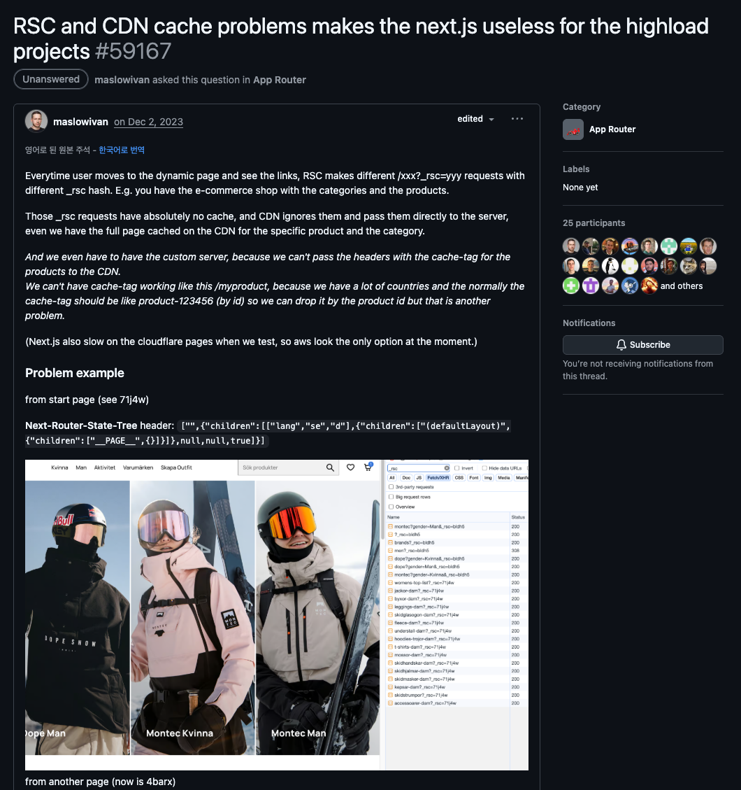
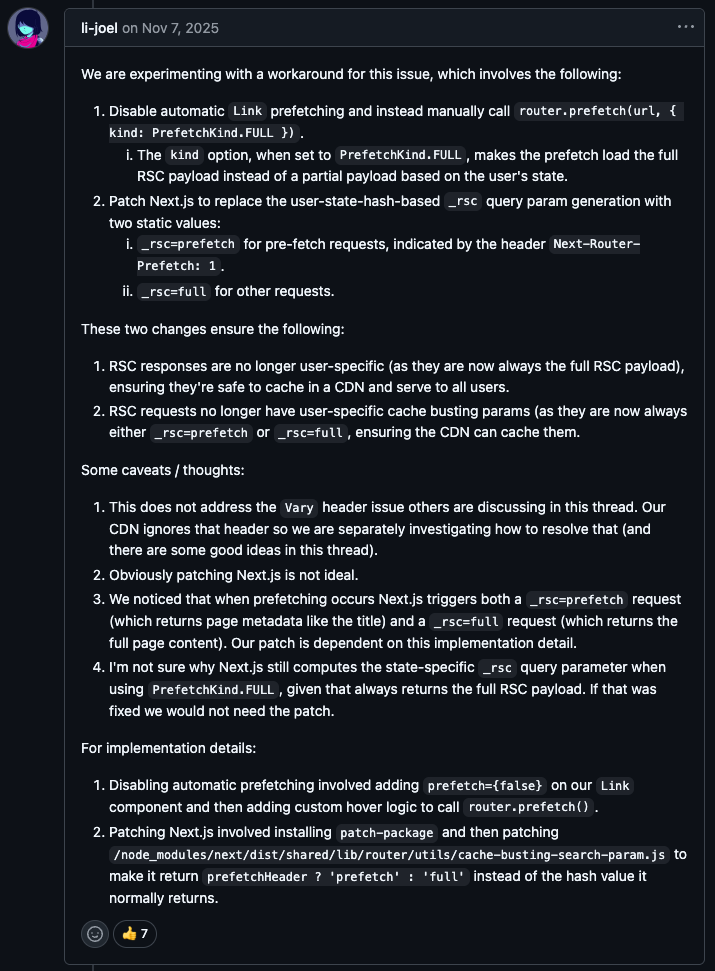

## Next.js App Router와 CDN의 불편한 진실: RSC 캐시 문제와 PPR이라는 해법

최근 새로운 프로젝트인 핑크퐁 홈페이지 리뉴얼 작업을 맡게 되었습니다. 글로벌 서비스인 만큼 SEO와 전 세계 어디서든 빠른 접속을 보장하는 글로벌 CDN 도입은 선택이 아닌 필수였습니다.

하지만 기술 검토 과정에서 팀원 한 분이 충격적인 이슈를 공유해 주셨습니다. 바로 ["Server Component는 CDN 환경에서 캐시가 제대로 작동하지 않는다"](https://github.com/vercel/next.js/issues/65335)는 것이었죠.

단순한 루머가 아니었습니다. [공식 Discussion](https://github.com/vercel/next.js/discussions/59167)에서도 뜨겁게 논의되고 있는 이 문제는 서비스의 확장성을 고민하던 저희 팀에게 큰 과제로 다가왔습니다.



왜 이런 문제가 발생하는지, 그리고 이에 대한 해결방법은 따로 없었는지 그 고민에 대한 과정을 공유해보고자 합니다.

## 문제의 핵심: \_rsc 쿼리 파라미터

### 두 가지 요청 방식의 차이

일반적으로 저희가 원하는 페이지에 접근하는 방식은 크게 두 가지입니다:

| 요청 방식                    | 응답 타입   | CDN 캐싱      |
| ---------------------------- | ----------- | ------------- |
| **직접 URL 접속 / 새로고침** | HTML        | ✅ 정상 캐싱  |
| **Link 태그로 이동 (SPA)**   | RSC Payload | ❌ 캐시 미스! |

이때 RSC가 불러와지는 과정은 크게 두 가지입니다:

### 브라우저에서 URL을 직접 입력하거나 새로고침할때

1. 서버는 HTML 문서를 응답합니다. 이때 서버는 요청받은 페이지의 컴포넌트 트리를 실행합니다.
2. 서버에서 Server Component 코드를 실행합니다.
3. 실행된 결과를 RSC Payload라는 특별한 데이터 포맷으로 변환됩니다.
4. 변환된 RSC Payload를 HTML 문서에 포함하여 응답합니다.
5. 브라우저는 서버에서 받은 HTML을 즉시 화면에 그립니다. 이때 자바스크립트와 연결되어 있지 않아서 버튼을 눌러도 반응이 없는 상태로 넘어오게 됩니다.
6. 이제 브라우저는 브라우저가 자바스크립트 번들(React, Client Component 코드)을 다운로드하고 실행합니다.
7. RSC Payload를 통해 트리를 재구성하게 됩니다.
8. 이때 클라이언트 컴포넌트 자리에만 이벤트 리스너를 연결하여 상호작용 가능한 상태로 만들게 됩니다.

### Link 태그로 이동할 때

1. 브라우저는 `<Link>` 컴포넌트를 통해 SPA 방식으로 페이지를 이동합니다.
2. 서버는 이미 생성되어있는 HTML파일 때문에 따로 다시 HTML 파일을 생성하지 않고, 바뀌는 부분의 RSC Payload를 생성하고 응답을 보내게 됩니다.
3. 브라우저는 서버에서 받은 RSC Payload를 기존에 떠 있는 DOM 트리와 비교하여 변경된 부분만 갈아끼우는 reconciliation 과정을 거칩니다.
4. 이때 필요한 경우에만 자바스크립트 번들을 다운로드합니다.
5. RSC Payload를 통해 트리를 재구성하게 됩니다.
6. 이때 클라이언트 컴포넌트 자리에만 이벤트 리스너를 연결하여 상호작용 가능한 상태로 만들게 됩니다.

이때 네트워크 탭을 보면 `_rsc=????`라는 요상한 파라미터를 보게 되는데요.

```
GET /ko/characters?_rsc=abc123
GET /ko/characters?_rsc=xyz789
```

문제는 이 `_rsc` 해시값이 클라이언트의 라우터 상태에 따라 **매번 달라진다**는 것입니다. 같은 페이지인데도 URL이 다르니, CDN 입장에서는 별개의 요청으로 인식하여 캐시 히트율이 급격히 떨어지게 됩니다.

## 왜 Next.js는 이렇게 설계했을까?

같은 페이지인데 왜 `_rsc` 해시값이 다르게 생성되는 걸까요? 궁금해서 Next.js 소스코드를 직접 까봤습니다.

### 1. 현재 라우터 상태를 헤더에 담아 서버로 전송

Link를 클릭하면 가장 먼저 현재 클라이언트의 라우터 상태를 `Next-Router-State-Tree` 헤더에 담아 서버로 전송합니다.

```typescript
// packages/next/src/client/components/router-reducer/fetch-server-response.ts
export async function fetchServerResponse(url: URL, options: FetchServerResponseOptions) {
  const { flightRouterState, nextUrl } = options;

  const headers: RequestHeaders = {
    [RSC_HEADER]: '1',
    // 👇 현재 라우터 상태 트리를 헤더에 포함
    [NEXT_ROUTER_STATE_TREE_HEADER]: prepareFlightRouterStateForRequest(
      flightRouterState,
      options.isHmrRefresh
    ),
  };
  // ...
}
```

이 헤더에는 현재 활성화된 레이아웃, 세그먼트 정보 등이 포함되어 있습니다. 실제로 네트워크 탭을 열어보면 이런 헤더를 볼 수 있어요:

```json
next-router-state-tree: ["",{"children":["__PAGE__",{},null,null,false]},null,null,true]
```

이 JSON 구조를 해석하면:

- `""`: 현재 루트 세그먼트
- `{"children":["__PAGE__",...]}`: 현재 페이지가 어떤 레이아웃 아래에 있는지
- 나머지 값들: 병렬 라우트, 로딩 상태 등 메타데이터

즉, **"지금 사용자가 어떤 레이아웃 구조 안에 있는지"** 를 서버에 알려주는 것 입니다.
그래서 서버는 이 정보를 보고 이미 클라이언트가 가지고 있는 레이아웃은 제외하고, 변경된 부분만 RSC Payload로 보내줍니다.

그런데 여기서 문제가 발생합니다. 이 `next-router-state-tree` 값이 바로 `_rsc` 해시 계산에 사용되거든요.

### 2. 라우터 상태 기반으로 \_rsc 해시 생성

`_rsc` 해시가 어떻게 만들어지는지 `computeCacheBustingSearchParam` 함수를 살펴보면:

```typescript
// packages/next/src/shared/lib/router/utils/cache-busting-search-param.ts
export function computeCacheBustingSearchParam(
  prefetchHeader,
  segmentPrefetchHeader,
  stateTreeHeader, // 👈 이게 next-router-state-tree 값!
  nextUrlHeader
): string {
  return hexHash(
    [
      prefetchHeader || '0',
      segmentPrefetchHeader || '0',
      stateTreeHeader || '0',
      nextUrlHeader || '0',
    ].join(',') // 이 4개를 쉼표로 이어붙여서 해시 생성
  );
}
```

이 함수는 아래처럼 RSC Payload 요청 시 호출되어 URL에 `_rsc` 파라미터를 추가합니다:

```typescript
// packages/next/src/client/components/router-reducer/set-cache-busting-search-param.ts
export const setCacheBustingSearchParam = (url: URL, headers: RequestHeaders): void => {
  const uniqueCacheKey = computeCacheBustingSearchParam(
    headers[NEXT_ROUTER_PREFETCH_HEADER], // 프리페치 여부
    headers[NEXT_ROUTER_SEGMENT_PREFETCH_HEADER], // 세그먼트 프리페치
    headers[NEXT_ROUTER_STATE_TREE_HEADER], // 👈 라우터 상태 트리!
    headers[NEXT_URL] // 현재 URL
  );
  setCacheBustingSearchParamWithHash(url, uniqueCacheKey);
};
```

결국 `_rsc` 해시값은 **4가지 헤더 값을 쉼표로 이어붙인 문자열**을 해시한 결과입니다. 그중 `stateTreeHeader`가 바로 아까 본 `next-router-state-tree` 값이고요.

## 결국 CDN 캐시가 깨지는 이유

결국 이런 생성 방식이 역으로 문제가 됩니다. **라우터 상태 트리가 사용자의 이전 방문 경로에 따라 달라지기 때문이에요:**

```
사용자 A: /ko (홈) → /ko/characters
  => Next-Router-State-Tree: ["",{"children":["ko",{"children":["characters",...]}]}]
  => _rsc=abc123

사용자 B: /ko/news (뉴스) → /ko/characters
  => Next-Router-State-Tree: ["",{"children":["ko",{"children":["news",{"children":["characters",...]}]}]}]
  => _rsc=xyz789
```

같은 `/ko/characters` 페이지인데 **어디서 왔느냐에 따라 `_rsc` 해시가 달라집니다**. CDN 입장에서는 완전히 별개의 URL로 인식하니, 캐시 히트는커녕 **모든 요청이 Origin으로 전달**되는 거죠.

## 그렇다면 해시값을 고정시키면 어떨까?

이런 고민 와중에 Discussion 내 한 새로운 해결법의 댓글을 발견했습니다. 바로 "그냥 `_rsc` 해시값을 고정시켜버리면 되는 거 아닌가?" 라는 아이디어였습니다. 실제로 이 방법은 효과가 있습니다!



<p class="caption">GitHub Discussion에서 li-joel이 제안한 해결책 (2025년 11월)</p>

해당 댓글의 해결책 총 2가지가 있었는데요!

### 1. 자동 프리페칭 비활성화 + 수동 Full 프리페칭

```tsx
// Link 컴포넌트의 자동 프리페칭 비활성화
<Link href="/characters" prefetch={false}>
  캐릭터
</Link>;

// 호버 시 수동으로 Full 프리페칭 호출
const handleHover = () => {
  router.prefetch('/characters', { kind: PrefetchKind.FULL });
};
```

`PrefetchKind.FULL`을 사용하면 사용자의 라우터 상태에 따른 부분 Payload 대신 **전체 RSC Payload**를 프리페칭하여 아예 해시값을 고정시켜버려서 페이지 전체를 CDN에 태우는 방식입니다.

### 2. Next.js 패치로 해시값 고정

아니면 `patch-package`를 사용하여 Next.js의 해시 생성 로직을 수정합니다:

```javascript
// node_modules/next/dist/shared/lib/router/utils/cache-busting-search-param.js

// Before: 사용자 상태 기반 해시 반환
return hexHash([prefetchHeader, segmentPrefetchHeader, stateTreeHeader, nextUrlHeader].join(','));

// After: 정적 값으로 대체
return prefetchHeader ? 'prefetch' : 'full';
```

이런식으로 stateTreeHeader자체를 무시하고 prefetchHeader일 경우 prefetch라는 해시값으로 고정하고 아닐경우 full로 반환하는 방식입니다. 그러면 프리페치 요청은 `?_rsc=prefetch` (헤더에 `Next-Router-Prefetch: 1` 포함), 일반 요청은 `?_rsc=full`로 고정되죠.

이 두 가지 방법의 핵심은 **RSC 응답이 더 이상 사용자별로 구분되지 않는다**는 점입니다. 항상 전체 RSC Payload를 반환하니 CDN에 안전하게 캐싱할 수 있고, `_rsc` 파라미터도 `prefetch` 또는 `full` 두 가지뿐이니 캐시 히트율이 급상승하죠.

### 물론 트레이드오프는 존재합니다

해시값을 고정하면 서버는 클라이언트의 라우터 상태를 알 수 없게 됩니다. 그래서 서버는 **안전하게 전체 페이지의 RSC Payload를 반환**하게 되죠.

| 구분            | 부분 프리페칭 (기본)   | 전체 프리페칭 (해시 고정) |
| --------------- | ---------------------- | ------------------------- |
| Payload 크기    | 변경된 부분만 (가벼움) | 전체 페이지 (무거움)      |
| CDN 캐시 히트율 | 낮음 ❌                | 높음 ✅                   |
| 네트워크 비용   | 적음                   | 많음                      |
| 서버 연산량     | 적음                   | 많음                      |

결국 해시값을 고정시키게 되면서 Next.js App Router과 Server Component의 조합을 통해 클라이언트가 가지고 있는 레이아웃을 제외하고 변경된 부분만 보내서 대역폭을 절약하는 **부분 프리페칭(Partial Prefetch)** 을 포기하고 이 이점을 포기해야하는 상황이 발생합니다.

다만 댓글 작성자도 몇 가지 주의할 점을 남겼는데요.

- **`Vary` 헤더 문제는 별도** - 이 방법은 `_rsc` 파라미터 문제만 해결합니다. CDN이 `Vary` 헤더를 무시하는 경우 추가적인 설정이 필요합니다.
- **패치는 유지보수 부담** - Next.js 버전이 올라갈 때마다 패치를 다시 적용해야 합니다.
- **구현 세부사항 의존성** - Next.js는 프리페칭 시 `_rsc=prefetch`(메타데이터)와 `_rsc=full`(전체 콘텐츠) 두 가지 요청을 발생시키는데, 이 패치는 이러한 동작에 의존합니다.
- **의문점** - `PrefetchKind.FULL` 사용 시에도 왜 상태별 `_rsc` 해시가 계산되는지 불분명합니다. 항상 전체 RSC Payload를 반환하는데 말이죠. 이 부분이 수정된다면 패치 자체가 필요 없어질 겁니다.

## 그러면 진짜 근본적인 해결책은 없는걸까,,,?

다행히 Next.js 팀에서 이 문제를 인지하고 적극적으로 해결하고 있습니다.


<p class="caption">Next.js 팀 멤버 ztanner의 GitHub 댓글 (2025년 1월)</p>

> "현재 라우터 프리페칭 동작과 관련된 이 이슈를 해결하기 위해 라우터 리팩토링 작업을 진행 중입니다. **새로운 구현에서는 더 이상 `?_rsc` 헤더가 필요하지 않습니다.** 이 작업은 높은 우선순위로 진행되고 있으며, 응답의 캐시 가능성을 개선하고, 라우터가 아직 가지고 있지 않은 정보만 요청하도록 전송 계층을 개선하는 것을 목표로 하고 있습니다."

## 내가 생각하기에는,,,

과거 React로 SPA를 구현하며 CSR의 한계를 느꼈던 시절, 저희는 SEO와 SSR의 이점을 얻기 위해 Next.js를 선택했습니다.

Next.js는 여기서 한 걸음 더 나아가, MPA의 안정성과 SPA의 부드러운 상호작용을 '페이지'가 아닌 '컴포넌트' 단위로 융합하고자 했습니다. 이 야심 찬 목표를 위해 App Router와 Server Component가 도입되었지만, 그 복잡성으로 인해 \_rsc 캐시 문제와 같은 새로운 난관에 부딪히게 된 것이죠.

결국 지금 겪고 있는 이 불편함은 완벽한 하이브리드 웹을 향한 과도기적 성장통이 아닐까 싶습니다. [Discussion](https://github.com/vercel/next.js/discussions/59167)에서 지금도 활발하게 논의가 이어지고 있으니, 더 좋은 해결책을 알고 계시다면 댓글로 공유 부탁드려요! 🙏

## 참고 자료

- [GitHub Discussion: RSC and CDN cache problems makes the next.js useless for the highload projects](https://github.com/vercel/next.js/discussions/59167)
- [RSC and CDN interaction makes next.js inefficient for highload projects](https://github.com/vercel/next.js/issues/65335)
- [Caching in Next.js](https://nextjs.org/docs/app/guides/caching)
- [Linking and Navigating](https://nextjs.org/docs/app/getting-started/linking-and-navigating)
- [How do Server and Client Components work in Next.js?](https://nextjs.org/docs/app/getting-started/server-and-client-components#how-do-server-and-client-components-work-in-nextjs)
- [Next.js Source Code:fetch-server-response.ts](https://github.com/vercel/next.js/blob/canary/packages/next/src/client/components/router-reducer/fetch-server-response.ts)
- [Next.js Source Code:cache-busting-search-param.ts](https://github.com/vercel/next.js/blob/canary/packages/next/src/shared/lib/router/utils/cache-busting-search-param.ts)
- [Next.js Source Code:set-cache-busting-search-param.ts](https://github.com/vercel/next.js/blob/canary/packages/next/src/client/components/router-reducer/set-cache-busting-search-param.ts)
