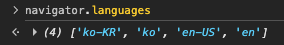
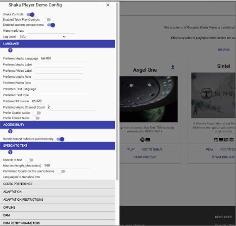
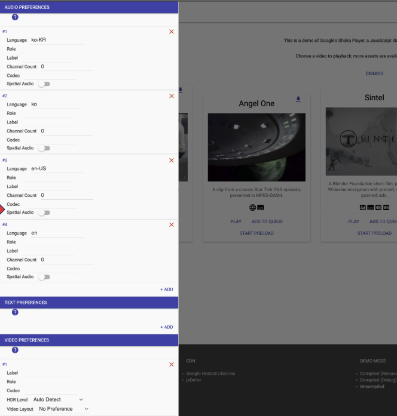
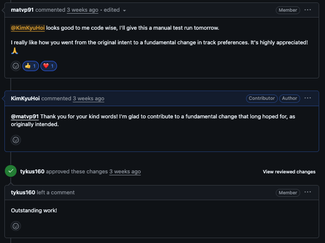

[이전 글](/shaka-retry-licensing/)에서 `retryLicensing()` PR이 머지된 뒤, Shaka Player를 처음 접했을 때 눈여겨봤다가 냅뒀던 이슈를 드디어 꺼냈습니다.

- [Issue #1591: Expand language config to a list](https://github.com/shaka-project/shaka-player/issues/1591)

## 기존 설정의 한계

Shaka Player로 영상을 재생할 때, 어떤 언어의 오디오·자막 트랙을 먼저 선택할지 설정할 수 있습니다. 한국어 오디오를 기본으로 재생하고 싶다면:

```javascript
player.configure({
  preferredAudioLanguage: 'ko',
});
```

위처럼 설정할 수 있었습니다. 영상에 한국어(`ko`)와 영어(`en`) 트랙이 모두 있으면 Shaka Player가 알아서 한국어 트랙을 선택해줍니다. 언어 외에도 채널 수나 코덱 같은 세부 조건도 설정할 수 있었습니다.

```javascript
player.configure({
  preferredAudioChannelCount: 6, // 5.1채널 서라운드 선호
  preferredAudioCodecs: 'ec-3', // Dolby Digital Plus 선호
  preferredSpatialAudio: false, // 공간음향 비선호
});
```

이런 설정들을 오디오·텍스트·영상 전부 나열하면 총 14개의 개별 필드가 됩니다.

```javascript
// 오디오 관련
preferredAudioLanguage: 'ko',
preferredAudioRole: '',
preferredAudioLabel: '',
preferredAudioChannelCount: 2,
preferredAudioCodecs: '',
preferredSpatialAudio: false,

// 텍스트 관련
preferredTextLanguage: 'ko',
preferredTextRole: '',
preferredTextFormat: '',

// 영상 관련
preferredVideoLabel: '',
preferredVideoHdrLevel: '',
preferredVideoLayout: '',
preferredVideoCodecs: '',

// 기타
preferForcedSubs: false,
```

문제는 이 설정들이 각각 **단일 값**만 받는다는 점입니다. "한국어 5.1채널이 없으면 한국어, 그것도 없으면 영어"처럼 **조건을 조합한 우선순위 표현이 아예 불가능**했습니다.

브라우저는 이미 `navigator.languages`를 통해 우선순위가 있는 언어 목록을 제공하는데, 지금 콘솔 열어서 찍어보면 이런 형태로 나옵니다.

```javascript
navigator.languages; // ['ko', 'en-US', 'en']
```


<div class="caption">브라우저 콘솔에서 직접 확인한 navigator.languages 값</div>

그런데 Shaka Player는 이 배열에서 첫 번째 값 하나만 쓸 수 있었던 거죠.

## 처음엔 단순해 보였는데

처음에 생각한 구현은 단순했습니다. `preferredAudioLanguage: string`을 `preferredAudioLanguages: string[]`으로 확장하고 기존 필드는 deprecated 처리하면 끝이라고 생각했거든요.

그런데 PR을 올리고 나서 메인테이너들로부터 더 큰 그림을 제안받았습니다.

> "I would strongly prefer reducing the set of streams using a list of preferences. Allowing multiple languages introduces questions around multiple roles, codecs, and their possible combinations."

언어만 배열로 만드는 게 아니라, **언어·역할·코덱·채널 수 같은 모든 조건을 하나의 객체로 묶어서 우선순위 배열로 표현**하자는 거였습니다. 이미 이슈 코멘트에서 이런 설계가 논의되고 있기도 했습니다.

```javascript
preferredAudio: [{
  language?: string,
  role?: string,
  label?: string,
  channelCount?: number,
  codecs?: string
}]
```

여기에 `spatialAudio` 플래그와 `preferredText`, `preferredVideo`까지 필요하다는 의견이 더해졌습니다.

```javascript
preferredVideo: [{
  label?: string,
  role?: string,
  codec?: string,
  hdrLevel?: string,
  layout?: string,
}]
```

처음 생각한 것보다 범위가 훨씬 커졌지만, 어차피 할 거면 제대로 만들어보기로 했습니다.

## 새로운 설계: 3개의 구조화된 배열

14개 필드를 오디오·텍스트·영상 각각의 **Preference 객체 배열** 3개로 대체했습니다.

```typescript
interface AudioPreference {
  language?: string; // 언어 (예: 'ko', 'en')
  role?: string; // 역할 (예: 'main', 'commentary')
  label?: string; // 레이블
  channelCount?: number; // 채널 수 (예: 6 = 5.1채널)
  codecs?: string; // 코덱 (예: 'ec-3' = Dolby Digital Plus)
  spatialAudio?: boolean; // 공간음향 여부
}

interface TextPreference {
  language?: string;
  role?: string;
  format?: string; // 자막 형식 (예: 'vtt', 'ttml')
  forced?: boolean; // 강제 자막 여부
}

interface VideoPreference {
  label?: string;
  role?: string;
  codec?: string;
  hdrLevel?: string; // HDR 레벨 (예: 'PQ', 'HLG')
  layout?: string; // 레이아웃 (예: 'CH-STEREO')
}
```

모든 필드가 optional이라 지정한 조건만 필터로 작동하고, 이 객체들을 배열로 넘기면 됩니다. 동작 방식은 **항목 내부는 AND 조건, 항목 간 순서는 우선순위**입니다.

"한국어 5.1채널이 없으면 한국어, 그것도 없으면 영어"를 이렇게 표현할 수 있습니다.

```javascript
player.configure('preferredAudio', [
  { language: 'ko', channelCount: 6 }, // 1순위: 한국어 5.1채널
  { language: 'ko' }, // 2순위: 한국어 (채널 무관)
  { language: 'en' }, // 3순위: 영어
]);
```

기존에는 셋 중 하나만 골라야 했는데, 이제는 우선순위 목록 전체를 표현할 수 있게 됐습니다.

## 하위 호환성 처리

사실 처음 PR을 올릴 때 deprecated 처리를 아예 빼버렸습니다. "어차피 breaking change 릴리즈니까 기존 필드는 그냥 없애도 된다"고 생각했거든요. 그런데 리뷰 과정에서 v5.0이 이미 릴리즈된 상태라는 걸 뒤늦게 알게 됐습니다. 결국 지웠던 deprecated 처리를 14개 필드 전부에 다시 꼼꼼하게 채워넣어야 했습니다.

`player.configure()`에서 기존 필드 이름을 감지하면 새 구조로 변환하고, `shaka.Deprecate.deprecateFeature()`로 경고를 띄우는 방식이었습니다.

```javascript
if (config.preferredAudioLanguage !== undefined) {
  shaka.Deprecate.deprecateFeature(
    5,
    'preferredAudioLanguage',
    'Use preferredAudio[].language instead.'
  );
  config.preferredAudio = config.preferredAudio || [];
  if (config.preferredAudio.length === 0) {
    config.preferredAudio.push({ language: config.preferredAudioLanguage });
  }
}
```

기존 앱은 당장 깨지지 않고 콘솔에 deprecated 경고만 보이게 됩니다.

이 과정에서 기존 패턴을 파악하려고 v4.16 브랜치를 직접 뒤져가며 어떻게 처리했는지 확인했는데요. 단순히 새 기능을 추가하는 게 아니라 **이미 세상에 나가 있는 앱들을 고려하면서 API를 설계**해야 한다는 걸 이때 처음 제대로 느꼈습니다. 기능 구현이랑은 또 다른 종류의 고민이더라고요.

> "Look at older branches (e.g., v4.16) to see how to do it."

## Demo UI도 함께

설정 구조를 바꿨으니 데모 앱 UI도 당연히 손을 봐야 했습니다.

기존 데모 UI는 `Preferred Audio Language`, `Preferred Audio Role`, `Preferred Audio Channel Count` 같은 필드들이 각각 개별 텍스트 입력으로 나열돼 있었는데요.


<div class="caption">기존 Demo Config UI - 14개의 개별 입력 필드</div>

새 구조에 맞게 **인라인 확장 가능한 우선순위 목록**으로 바꿨습니다. 항목을 추가/삭제하고 필드를 편집할 수 있고, URL 해시 직렬화도 JSON 형식으로 업데이트했습니다.


<div class="caption">수정된 Demo Config UI - 우선순위 목록으로 항목을 추가/편집 가능</div>

그렇게 PR이 마무리되면서 이런 코멘트를 받았습니다.


<div class="caption">"I really like how you went from the original intent to a fundamental change in track preferences. It's highly appreciated!"</div>

처음엔 언어 배열 확장이었던 PR이 트랙 설정 전체의 재설계로 이어진 과정을 알아봐줬다는 게 뿌듯했습니다.

## 마치며

이 이슈가 6년 동안 열려있던 데는 이유가 있었습니다. 언어 필드 하나를 배열로 바꾸는 것처럼 보이지만, 실제로는 기존 앱 전체에 영향을 주는 breaking change였거든요. "이렇게 하면 좋겠다"는 방향은 이슈 코멘트에서 오래전부터 논의되고 있었는데, 막상 실행에 옮기려면 하위 호환성, 설계 범위, 릴리즈 타이밍 같은 현실적인 문제들이 얽혀 있었습니다.

그 의논들이 쌓이고 쌓인 이슈를 직접 해결할 수 있었다는 게 이번에 가장 기뻤습니다. 단순히 기능 하나를 추가했다기보다, 커뮤니티가 오랫동안 원했던 방향을 실제로 구현해냈다는 느낌이었거든요. 앞으로도 Shaka Player에 조금씩 기여해나갈 예정입니다.

> 🔗 이전 글이 궁금하시다면:
>
> - [Google Shaka Player에 첫 PR을 보냈습니다](/shaka-player/) - EME MediaKeySessionClosedReason 구현
> - [TC39 proposal-upsert를 Shaka Player에 적용하기까지](/shaka-tc39/) - Map.getOrInsert 폴리필
> - [DRM도 갱신하는 법이 다릅니다](/shaka-renewal-licensing/) - DRM 라이선스 자동 갱신
> - [라이선스 요청이 실패하면 어떻게 될까?](/shaka-retry-licensing/) - retryLicensing() 구현

## 관련 링크

### GitHub

- [PR #9542: feat: Select default track by a list of preferences](https://github.com/shaka-project/shaka-player/pull/9542)
- [Issue #1591: Expand language config to a list](https://github.com/shaka-project/shaka-player/issues/1591)
