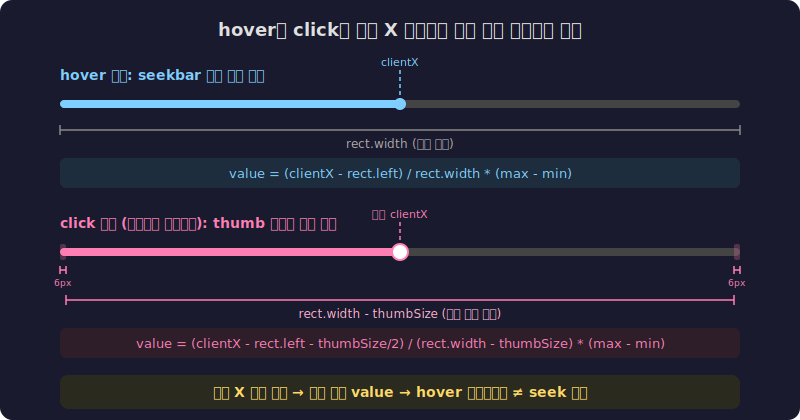

[이전 글](/shaka-ui-config/)에서 데모 앱 UI 설정을 다루면서 Shaka Player의 UI 컴포넌트를 살펴볼 기회가 있었는데요. 그 무렵 seekbar 관련 버그 이슈가 눈에 들어왔습니다.

- [Issue #9327: Seeking to hover timestamp does not match actual seek position](https://github.com/shaka-project/shaka-player/issues/9327)

## 문제: hover 위치와 seek 위치가 다르다

<video src="./issues-seekbar.mp4" autoplay loop muted playsinline style="width: 100%; display: block; margin: 0 auto;"></video>

<div class="caption">hover 시 보여주는 타임스탬프와 실제 seek 위치가 다른 모습</div>

seekbar 위에 마우스를 올리면 해당 위치의 타임스탬프가 표시됩니다. 그런데 그 상태에서 클릭하면, **실제로 seek되는 위치가 hover에서 보여줬던 시간과 다른** 버그였습니다. 짧은 영상에서는 눈에 잘 안 띄지만, 긴 영상일수록 차이가 뚜렷해졌습니다.

원인은 이슈 코멘트에서 이미 분석되어 있었습니다. hover 시 타임스탬프를 계산하는 공식과, `<input type="range">`가 클릭 시 값을 계산하는 공식이 **서로 달랐던 겁니다**.

```javascript
// hover: seekbar 전체 너비 기준으로 단순 비율 계산
const mousePosition = event.clientX - rect.left;
const scale = (max - min) / rect.width;
const value = scale * mousePosition;

// 클릭(브라우저 네이티브): thumb 너비만큼 줄어든 영역 기준으로 계산
// thumb이 seekbar 양 끝을 벗어나지 않도록 보정하기 때문
```

hover는 seekbar 전체 너비(`rect.width`)를 기준으로 계산하는데, 브라우저의 `<input type="range">`는 thumb 크기를 고려해서 **양 끝이 좁아진 영역**에서 값을 계산합니다. 이 차이 때문에 같은 X 좌표를 클릭해도 hover가 보여준 값과 실제 seek 값이 달랐던 거죠.

이미 다른 기여자가 PR #9429로 수정을 시도했지만, 시각적 떨림이 발생해서 revert된 상태였습니다. 그래서 제가 이어서 해보기로 했습니다.

## 첫 번째 시도: PR #9818

접근은 명확했습니다. 클릭할 때 브라우저의 네이티브 range 동작에 맡기지 말고, hover와 동일한 `getValueFromPosition()` 함수를 통해 값을 계산하면 되지 않을까?

```javascript
// mousedown에서 브라우저 기본 동작을 막고
onMouseDown_(e) {
  e.preventDefault();
  this.setBarValueForMouse_(e);  // hover와 같은 함수로 값 계산
}
```

`e.preventDefault()`로 네이티브 range 동작을 막고, hover에서 쓰는 것과 같은 좌표→값 변환 함수를 통해 seek 값을 직접 계산했습니다. 기본 동작을 막았으니 드래그도 직접 구현해야 해서, `mousemove`와 `mouseup` 리스너를 document에 붙이는 방식으로 처리했습니다.

머지까지 됐습니다. 그런데 테스터가 확인해보니 **클릭한 뒤 타임스탬프 tooltip이 살짝 왼쪽으로 밀리는** 현상이 보고됐습니다.

<video src="./issue2.mov" autoplay loop muted playsinline style="width: 100%; display: block; margin: 0 auto;"></video>

<div class="caption">클릭 후 tooltip이 살짝 왼쪽으로 밀리는 현상</div>

원인을 찾아보니, 클릭 시 값을 구하는 방향(픽셀→값)은 `getValueFromPosition()`으로 통일했는데, 클릭 후 tooltip 위치를 구하는 반대 방향(값→픽셀)의 `onChange()`에서는 **thumb 보정 없이 단순 비율로 픽셀을 계산**하고 있었던 겁니다. 한쪽만 고치고 반대쪽을 놓친 거죠.

## 두 번째 시도: PR #9827

그러면 `onChange()`에도 thumb 크기 보정을 넣으면 되겠다고 생각했습니다.

```javascript
// BEFORE: 단순 비율
const scale = (max - min) / rect.width;
const position = (value - min) / scale;

// AFTER: thumb 크기 보정 추가
const thumbSize = 12; // @thumb-size in range_elements.less
const scale = (rect.width - thumbSize) / (max - min);
const position = (value - min) * scale + thumbSize / 2;
```

이것도 머지됐습니다. 그런데 다시 테스터 확인 결과, **Firefox에서 짧은 영상을 재생할 때 여전히 1~2px 정도 tooltip이 밀리는** 문제가 남아있었습니다. Chrome에서는 괜찮았지만 Firefox와 Brave에서 재현됐습니다.

이때 한 발 물러서 생각해봤습니다. hover와 onChange가 **서로 다른 공식으로** 픽셀 위치를 계산하고 있다는 근본적인 문제를 놓치고 있었습니다.

- hover(`mousemove`): `event.clientX - rect.left`로 직접 픽셀 계산
- onChange: `(value - min) * scale + thumbSize / 2`로 값에서 픽셀 역산

공식이 다르니 같은 위치라도 결과가 미세하게 달라질 수밖에 없었습니다. thumb 보정을 맞추는 게 아니라, **두 경로가 완전히 같은 함수를 쓰도록** 해야 했던 겁니다.


<div class="caption">같은 X 좌표를 클릭해도 계산 기준이 다르면 다른 value가 나온다</div>

## 세 번째 시도: PR #9840

핵심은 간단했습니다. 값(value)에서 픽셀 위치를 계산하는 공유 함수를 하나 만들고, hover와 onChange 모두 그 함수를 쓰게 하는 것.

```javascript
showThumbnailAtValue_(value) {
  const min = parseFloat(this.bar.min);
  const max = parseFloat(this.bar.max);
  const rect = this.bar.getBoundingClientRect();
  const thumbSize = 12;
  const scale = (rect.width - thumbSize) / (max - min);
  const position = (value - min) * scale + thumbSize / 2;
  this.showThumbnailAndTime_(position, value);
}
```

hover 경로도 바꿨습니다. 기존에는 `clientX`에서 바로 픽셀 위치를 구했는데, 이제는 `clientX → 값 → 픽셀` 순서로, 중간에 값 변환을 한 번 거치게 했습니다.

```javascript
// BEFORE: clientX에서 바로 픽셀 위치 사용
onMouseMove_(e) {
  const mousePosition = e.clientX - rect.left;
  this.showThumbnailAndTime_(mousePosition, value);
}

// AFTER: 값을 먼저 구하고, 공유 함수로 픽셀 위치 계산
onMouseMove_(e) {
  const value = this.getValueFromPosition(e.clientX);
  this.showThumbnailAtValue_(value);
}
```

이렇게 하면 hover든 클릭이든 **같은 값에 대해 항상 같은 픽셀 위치**가 나옵니다. 공식이 하나이니 어긋날 수가 없습니다.

테스터 확인까지 통과했고, 이번에는 추가 이슈 없이 마무리됐습니다.

## 마치며

결과적으로 하나의 버그를 고치는 데 PR을 3개 올렸습니다. 한쪽을 고치면 반대쪽이 깨지고, 반대쪽도 고치면 미세한 차이가 남고, 결국 함수를 통일해서야 해결됐습니다.

처음부터 "두 경로가 같은 함수를 써야 한다"는 답에 도달했으면 좋았겠지만, 실제로는 두 번 틀린 뒤에야 문제의 본질이 보였습니다. 아쉽지만 개발자분들과 소통하며 문제를 해결해나가는 과정 자체가 배움이었습니다.

> 🔗 이전 글이 궁금하시다면:
>
> - [Google Shaka Player에 첫 PR을 보냈습니다](/shaka-player/) - EME MediaKeySessionClosedReason 구현
> - [TC39 proposal-upsert를 Shaka Player에 적용하기까지](/shaka-tc39/) - Map.getOrInsert 폴리필
> - [DRM도 갱신하는 법이 다릅니다](/shaka-renewal-licensing/) - DRM 라이선스 자동 갱신
> - [라이선스 요청이 실패하면 어떻게 될까?](/shaka-retry-licensing/) - retryLicensing() 구현
> - [14개 필드를 3개로 - Shaka Player 트랙 설정의 재설계](/shaka-add-preference/) - 트랙 Preference 재설계
> - [콘솔 없이 UI를 설정할 수 있게](/shaka-ui-config/) - Demo UI Configuration

## 관련 링크

### GitHub

- [Issue #9327: Seeking to hover timestamp does not match actual seek position](https://github.com/shaka-project/shaka-player/issues/9327)
- [PR #9818: fix(UI): sync seek position with hover timestamp](https://github.com/shaka-project/shaka-player/pull/9818) - 첫 번째 시도
- [PR #9827: fix(UI): sync seek position with hover and onChange timestamp](https://github.com/shaka-project/shaka-player/pull/9827) - 두 번째 시도
- [PR #9840: fix(UI): sync seekbar on timestamp position value between mousemove and onChange](https://github.com/shaka-project/shaka-player/pull/9840) - 세 번째 시도 (최종)
