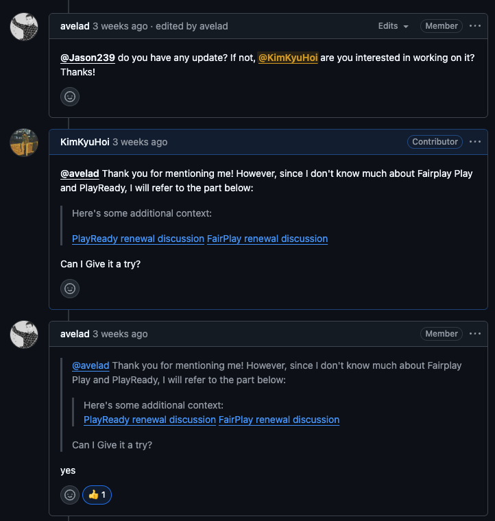
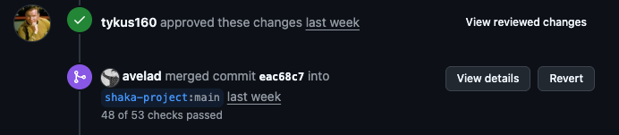
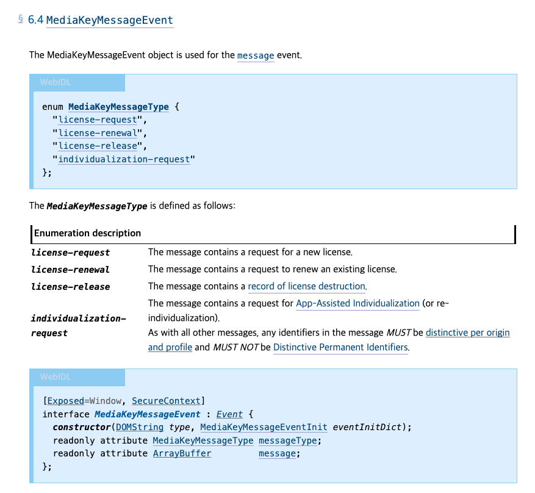
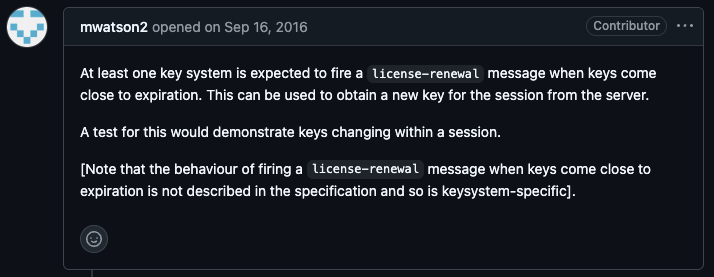
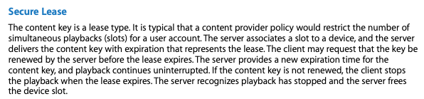
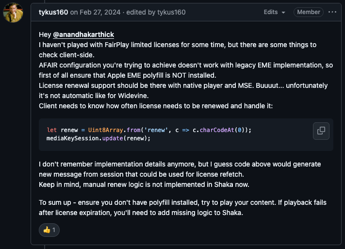
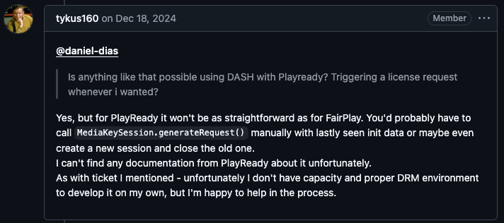
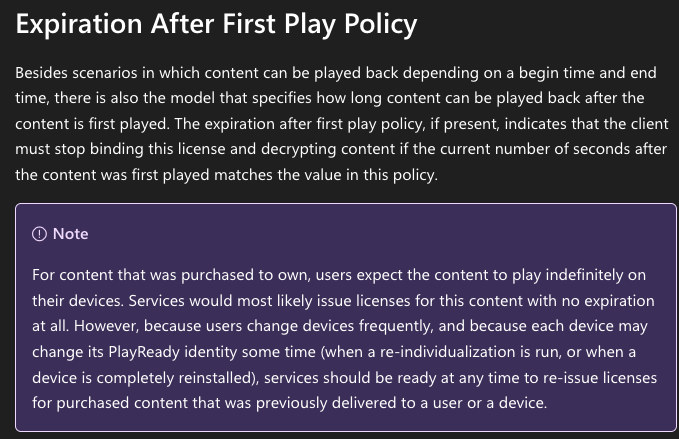

## "FairPlay랑 PlayReady는 잘 모르지만, 한번 해볼게요"

메인테이너가 이 이슈를 해결해보겠냐고 제안해주셨습니다

그렇게 시작된 이슈였습니다. 47개의 코멘트가 오간 코드리뷰 끝에, 드디어 Shaka Player에 세 번째 PR이 머지되었습니다.

PR이 승인되었습니다!

이 글에서는 그 과정에서 알게 된 DRM 라이선스 갱신의 파편화된 현실을 공유하려고 합니다.

## 왜 이 기능이 필요했을까?

CloudFront나 S3에서 signed URL을 발급받을 때, 만료 시간을 설정하잖아요. 1시간짜리 URL로 대용량 파일을 다운로드하다가 만료되면? 새로운 URL을 발급받아서 이어받아야 합니다.

DRM 라이선스도 비슷한 개념입니다. 콘텐츠를 복호화할 수 있는 키를 담은 라이선스에는 보안상 유효기간이 있고, 만료되면 새로운 라이선스를 받아야 영상을 계속 볼 수 있습니다.

문제는 이 "갱신"을 어떻게 하느냐가 DRM 시스템마다 완전히 다르다는 점입니다.

## 라이선스 발급, 어떻게 동작하나요?

> 💡 DRM과 EME의 기본 개념이 궁금하시다면 [Netflix 화면을 캡처하면 왜 검은 화면이 나올까?](/drm/) 글을 먼저 참고해주세요!

브라우저에서 암호화된 영상을 재생할 때, 라이선스를 발급받는 과정을 간단히 정리하면 이렇습니다.

EME(Encrypted Media Extensions) 아키텍처 - <a href="https://w3c.github.io/encrypted-media/">W3C 스펙 문서</a>

1. 브라우저가 암호화된 콘텐츠를 감지
2. `MediaKeySession`을 생성하고 라이선스 요청
3. 라이선스 서버에서 인증 후 라이선스 발급
4. CDM이 라이선스로 콘텐츠를 복호화

여기서 중요한 점은, **라이선스가 만료되면 이 과정을 다시 거쳐야 한다**는 것입니다. 그런데 각 DRM 벤더가 이를 어떻게 처리하는지는 스펙에 정의되어 있지 않습니다.

## W3C EME 스펙은 뭐라고 할까?

[W3C EME 스펙](https://w3c.github.io/encrypted-media/)에서는 `MediaKeyMessageEvent`의 `messageType`으로 네 가지 값을 정의하고 있습니다.

- `license-request`: 최초 라이선스 요청
- `license-renewal`: 라이선스 갱신 요청
- `license-release`: 라이선스 해제 요청
- `individualization-request`: 기기 개별화 요청

여기서 `license-renewal`이 바로 라이선스 갱신을 위한 메시지 타입입니다.

W3C EME 스펙의 MediaKeyMessageType 정의 - <a href="https://w3c.github.io/encrypted-media/#dom-mediakeymessagetype">W3C EME 스펙</a>

그런데 [web-platform-tests 이슈](https://github.com/web-platform-tests/wpt/issues/3740)를 보면 흥미로운 문장이 있습니다.

"keysystem-specific" - <a href="https://github.com/web-platform-tests/wpt/issues/3740">web-platform-tests/wpt Issue #3740</a>

번역하면, **"키 만료가 가까워졌을 때 license-renewal 메시지를 발생시키는 동작은 스펙에 정의되어 있지 않으며, 키 시스템마다 다르다"** 는 뜻입니다.

즉, EME는 `license-renewal`이라는 메시지 타입을 정의했을 뿐, **언제, 어떻게 이 메시지를 발생시킬지는 각 DRM 벤더가 알아서 구현**하도록 남겨둔 것이죠. 그래서 실제로 세 DRM이 어떻게 다른지 살펴보겠습니다.

## 세 DRM의 갱신 방식 비교

| 키 시스템     | 갱신 방식                                  | 자동화 수준 |
| ------------- | ------------------------------------------ | ----------- |
| **Widevine**  | CDM이 알아서 `license-renewal` 메시지 발생 | 완전 자동   |
| **FairPlay**  | `session.update('renew')` 호출 필요        | 수동 (단순) |
| **PlayReady** | 세션을 닫고 새로 생성해야 함               | 수동 (복잡) |

### Widevine

Google의 Widevine CDM은 라이선스 만료가 가까워지면 **자동으로** `license-renewal` 타입의 메시지를 발생시킵니다.

애플리케이션 입장에서는 별도 처리가 필요 없습니다. 기존에 `message` 이벤트를 처리하던 핸들러가 갱신 요청도 동일하게 처리해주니까요. 개발자 친화적인 방식입니다.

### FairPlay

Apple의 FairPlay는 Widevine처럼 자동으로 갱신 메시지를 보내지 않습니다. 대신, 애플리케이션이 **명시적으로 갱신을 요청**해야 합니다.

다행히 방법은 간단합니다. `session.update()`에 `'renew'` 문자열을 UTF-8로 인코딩해서 전달하면 됩니다. 그러면 FairPlay CDM이 새로운 라이선스 요청 메시지를 생성하고, 이후 흐름은 최초 라이선스 요청과 동일합니다.

Apple의 [FairPlay Streaming Overview](https://developer.apple.com/streaming/fps/FairPlayStreamingOverview.pdf) 문서를 보면, 라이선스 갱신 **개념** 자체는 공식적으로 지원합니다.

FairPlay Streaming Overview - Secure Lease 섹션

> "The client may request that the key be renewed by the server before the lease expires."

하지만 **웹 EME 환경에서 `session.update('renew')`를 호출하는 구체적인 방법**은 공식 문서에 없습니다. [Apple Developer Forums](https://developer.apple.com/forums/thread/731297)에서도 개발자들이 갱신 방법을 질문하고 있을 뿐, 명확한 답변은 없습니다. 이 방법은 [Shaka Player Issue #6280](https://github.com/shaka-project/shaka-player/issues/6280#issuecomment-1965983944)의 논의와 개발자 커뮤니티의 경험을 통해 알려진 것입니다.

FairPlay 라이선스 갱신 방법에 대한 논의 - <a href="https://github.com/shaka-project/shaka-player/issues/6280#issuecomment-1965983944">Issue #6280</a>

### PlayReady

Microsoft의 PlayReady는 가장 복잡합니다. FairPlay처럼 `update('renew')`를 호출해도 **동작하지 않습니다**.

PlayReady에서 라이선스를 갱신하려면 **기존 세션을 완전히 닫고, 새 세션을 생성한 뒤, 처음부터 다시 라이선스를 요청**해야 합니다.

왜 이렇게 복잡할까요? 놀랍게도 **Microsoft 공식 문서에도 이에 대한 명확한 설명이 없습니다.**

[Shaka Player Issue #7725](https://github.com/shaka-project/shaka-player/issues/7725#issuecomment-2548790975)에서 발견한 코멘트를 보면:

"I can't find any documentation from PlayReady about it unfortunately." - <a href="https://github.com/shaka-project/shaka-player/issues/7725#issuecomment-2548790975">Issue #7725</a>

[Microsoft의 PlayReady 문서](https://learn.microsoft.com/en-us/playready/overview/license-and-policies)에서는 라이선스 만료 정책에 대해 이렇게 설명합니다:

PlayReady 라이선스 만료 정책 - <a href="https://learn.microsoft.com/en-us/playready/overview/license-and-policies">Microsoft PlayReady 문서</a>

**"서비스는 언제든 라이선스를 재발급할 준비가 되어 있어야 한다"** 고만 언급할 뿐, 클라이언트에서 어떻게 갱신을 트리거해야 하는지는 설명하지 않습니다.

## 마치며

같은 "라이선스 갱신"이라는 기능이지만, DRM 시스템마다 이렇게 다른 방식으로 구현되어 있다는 게 흥미로웠습니다.

- **Widevine**은 개발자 친화적으로 자동 처리
- **FairPlay**는 단순하지만 공식 문서 없이 커뮤니티 경험에 의존
- **PlayReady**는 공식 문서도 없고, 세션을 닫고 새로 만들어야 합니다

W3C EME 스펙이 `license-renewal` 메시지 타입을 정의해두고도 실제 동작을 각 벤더에게 위임한 것이 이런 파편화의 원인이 아닐까 싶습니다.

이러한 차이점들을 Shaka Player에서 통합 처리하도록 [PR #9589](https://github.com/shaka-project/shaka-player/pull/9589)를 구현했고, 미디어 플레이어를 개발하시는 분들께 이 글이 도움이 되었으면 좋겠습니다.

## 관련 링크

### GitHub

- [PR #9589: feat: Add support for automatic license renewal](https://github.com/shaka-project/shaka-player/pull/9589)
- [Issue #9505: Support for automatic license renewal](https://github.com/shaka-project/shaka-player/issues/9505)
- [Issue #7725: PlayReady renewal discussion](https://github.com/shaka-project/shaka-player/issues/7725#issuecomment-2548790975)
- [Issue #6280: FairPlay renewal discussion](https://github.com/shaka-project/shaka-player/issues/6280#issuecomment-1965983944)
- [web-platform-tests/wpt Issue #3740](https://github.com/web-platform-tests/wpt/issues/3740)

### 공식 문서

- [W3C Encrypted Media Extensions](https://w3c.github.io/encrypted-media/)
- [MDN: MediaKeyMessageEvent.messageType](https://developer.mozilla.org/en-US/docs/Web/API/MediaKeyMessageEvent/messageType)
- [Microsoft PlayReady - License and Policies](https://learn.microsoft.com/en-us/playready/overview/license-and-policies)
- [Apple FairPlay Streaming](https://developer.apple.com/streaming/fps/)
- [Apple FairPlay Streaming Overview (PDF)](https://developer.apple.com/streaming/fps/FairPlayStreamingOverview.pdf)
