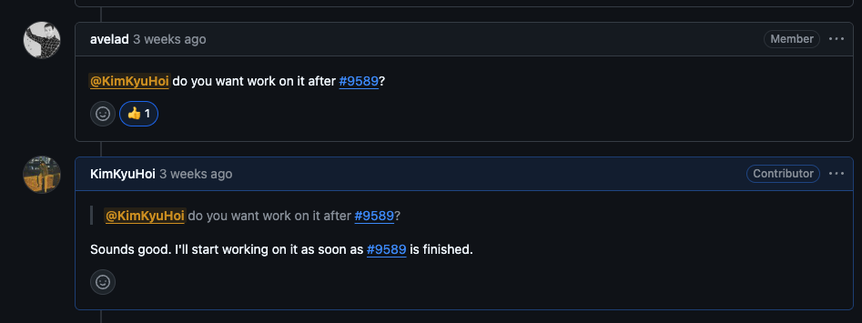
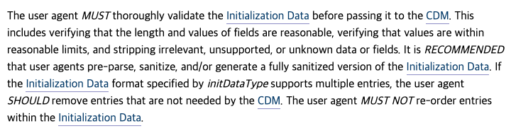

## "do you want work on it?"

[이전 글](/shaka-renewal-licensing/)에서 DRM 라이선스 갱신 기능을 구현한 [PR #9589](https://github.com/shaka-project/shaka-player/pull/9589)가 머지된 직후, 또 한 번 멘션이 왔습니다. (이정도면 이제 메인테이너분도 저를 아끼시는걸수도,,,?)


<div class="caption">"@KimKyuHoi do you want work on it after #9589?"</div>

이번에는 [Issue #1772](https://github.com/shaka-project/shaka-player/issues/1772), **`Player.retryLicensing()`** 이었습니다.

그런데 이 이슈를 열어보고 깜짝 놀랐습니다. 이슈가 생성된 날짜가 **2019년 1월**이었거든요. 무려 **7년** 동안 열려있던 이슈였습니다.

## 어떤 문제였을까?

[이전 글](/shaka-renewal-licensing/)에서 다뤘던 라이선스 **갱신**은 만료가 다가올 때 미리 새 라이선스를 받는 것이었습니다. 이번에는 다른 상황입니다. **사용 가능한 키가 없다는 신호를 받았을 때, 앱이 직접 대응할 수 있는 방법**이 필요한 것이죠.

이 이슈는 [#1771](https://github.com/shaka-project/shaka-player/issues/1771)의 후속으로, Shaka Player가 "사용 가능한 키가 없다"고 앱에 알려주면, 앱이 스스로 라이선스를 다시 요청할 수 있어야 한다는 것이 핵심이었습니다.

어떤 상황에서 필요할까요?

- **노트북 절전 모드**: 영상을 보다가 노트북을 덮었다가 열면, 라이선스가 만료되어 모든 키가 "expired" 상태가 됩니다
- **스마트 TV 백그라운드**: 앱을 백그라운드로 두었다가 돌아오면, 그 사이 라이선스가 만료되어 재생이 불가능해집니다. 실제로 이슈 코멘트에서 Tizen 디바이스 사용자가 [이 문제에 대한 커멘트를](https://github.com/shaka-project/shaka-player/issues/1772#issuecomment-1217243613) 하기도 했습니다
- **라이선스 요청 실패**: 네트워크 불안정이나 서버 장애로 라이선스 서버에 도달하지 못하는 경우

기존 Shaka Player에는 스트리밍 실패 시 재시도하는 `retryStreaming()`은 있었지만, **DRM 라이선스 실패에 대한 재시도 메커니즘은 없었습니다.** 라이선스 요청이 한 번 실패하면 그대로 fatal error가 되어 영상이 멈춰버렸죠. 그래서 이와 대응되는 `retryLicensing()`이 필요했습니다.

## EME 스펙의 제약: `generateRequest()`는 한 번만

구현을 시작하기 전에, 이 이슈에서 눈에 들어온 코멘트가 있었습니다.

> My assumptions here were incorrect and it cannot be implemented in a way I described. `MediaKeySession` allows to call `generateRequest()` only once - if session is initialized, it will fail.

처음에는 "같은 세션에서 `generateRequest()`를 다시 호출하면 되는 거 아닌가?"라고 생각했습니다. 하지만 [W3C EME 스펙](https://w3c.github.io/encrypted-media/#dom-mediakeysession-generaterequest)을 자세히 들여다보니, 그게 불가능한 이유가 명확했습니다.

### `generateRequest()`는 어떻게 동작할까?

`generateRequest()`는 `initData`를 기반으로 라이선스 요청 메시지를 생성하는 메서드입니다. W3C EME 스펙에 정의된 이 메서드의 전체 동작을 단계별로 살펴보겠습니다.

#### 1단계: 세션 상태 검사와 잠금

메서드가 호출되면 가장 먼저 세션의 상태를 확인합니다.

1. 세션의 `closing` 또는 `closed` 값이 `true`이면 → `InvalidStateError`로 reject
2. 세션의 `uninitialized` 값이 `false`이면 → `InvalidStateError`로 reject
3. **`uninitialized`를 `false`로 설정**

#### 2단계: 입력값 검증

이후 입력 파라미터를 순서대로 검증합니다.

1. `initDataType`이 빈 문자열이면 → `TypeError`로 reject
2. `initData`가 빈 배열이면 → `TypeError`로 reject
3. CDM이 해당 `initDataType`을 지원하지 않으면 → `NotSupportedError`로 reject

#### 3단계: initData Sanitize

여기서부터는 **병렬(parallel)** 로 실행됩니다.

1. `initData`가 해당 `initDataType`에 대해 유효한지 검증
2. 유효한 `initData`를 sanitized init data로 변환



W3C를 보면 이 정제 과정에 대해 네 단계의 요구사항을 명시하는데요.

- **MUST**: 브라우저는 `initData`를 CDM에 전달하기 전에 철저하게 검증해야 합니다. 필드의 길이와 값이 합리적인지, 값이 허용 범위 내에 있는지 확인하고, 관련 없거나 지원하지 않거나 알 수 없는 데이터나 필드는 제거해야 합니다
- **RECOMMENDED** (권장): 브라우저가 `initData`를 사전 파싱하고, 완전히 정제된 버전을 직접 생성하는 것이 권장됩니다
- **SHOULD** (해야 함): `initData`에 여러 항목이 포함된 경우, CDM에 불필요한 항목은 제거해야 합니다
- **MUST NOT** (절대 금지): 브라우저는 `initData` 내의 **항목 순서를 절대 변경해서는 안 됩니다**

정제가 실패하면 `TypeError`로 reject하고, 정제 후 데이터가 비어있으면 `NotSupportedError`로 reject합니다.

#### 4단계: CDM에게 라이선스 요청 생성 위임

정제된 `initData`를 CDM에 전달합니다. CDM은 먼저 자신이 이 데이터를 처리할 수 있는지 확인하고, 세션 타입에 따라 분기합니다.

- `"temporary"` → 반환되는 라이선스는 영구 저장할 수 없어야 합니다
- `"persistent-license"` → **고유한 세션 ID 생성**을 하게 되는데 이때 해당 오리진 내에서 시간이 지나도, 다른 문서나 브라우징 세션에서도 유일해야 합니다

CDM이 정제된 `initData`를 기반으로 라이선스 요청을 생성할 수 있으면 `"license-request"` 타입의 메시지를 만듭니다. 만약 라이선스를 요청하기 전에 별도의 처리(예: individualization)가 필요하면, `"individualization-request"` 타입의 메시지를 먼저 만듭니다.

이 과정에서 스펙이 명시하는 두 가지 제약이 있습니다.

- CDM은 **`initData` 외의 스트림별 데이터(미디어 데이터 등)를 사용해서는 안 됩니다**
- CDM은 이 시점에서 **세션 데이터를 저장해서는 안 됩니다** (저장은 이후 `update()` 호출 시 이루어집니다)

#### 5단계: 결과 처리

모든 과정이 성공하면 최종 처리를 수행합니다.

- 리소스 부족으로 실패했다면 → `QuotaExceededError`로 reject
- 그 외 이유로 실패했다면 → 적절한 `DOMException`으로 reject
- 성공 시:
  - 세션의 `sessionId` 속성을 설정
  - 세션의 `callable` 값을 `true`로 변경
  - promise를 resolve
  - `"license-request"` 또는 `"individualization-request"` 타입의 **`message` 이벤트를 큐에 넣음**

이 `message` 이벤트가 바로 라이선스 서버에 보낼 요청 메시지를 담고 있습니다. 애플리케이션은 이 이벤트를 수신해서 라이선스 서버에 전달하고, 응답을 `update()` 메서드로 세션에 전달하는 것이죠.

## 그래서 결국 왜 한 번만 호출할 수 있을까?

다시 1단계로 돌아가보겠습니다.

```text
첫 번째 호출:
  uninitialized = true  → 상태 확인 통과 ✅
  → uninitialized = false로 변경
  → initData 검증 → 정제 → CDM 위임 → 라이선스 요청 생성

두 번째 호출:
  uninitialized = false → InvalidStateError ❌ (1단계에서 즉시 거부)
```

`uninitialized` 플래그는 한 번 `false`가 되면 다시 `true`로 돌아가는 방법이 없습니다. 즉, `generateRequest()`는 **세션의 생애주기에서 딱 한 번만 호출할 수 있는** 일방통행 메서드인 것이죠.

이것은 EME 스펙이 **하나의 세션 = 하나의 초기화 데이터**라는 원칙을 따르기 때문입니다. 하나의 세션이 하나의 `initData`에만 바인딩되면, CDM이 관리해야 할 상태가 명확해지고, 세션 재초기화로 인한 보안 문제(세션 하이재킹, 라이선스 우회 등)도 원천 차단됩니다.

**결국에는...**
같은 세션에서 라이선스를 다시 요청하는 건 스펙 레벨에서 **불가능**합니다. 그래서 남은 선택지는 하나뿐이었습니다. **기존 세션을 닫고, 새 세션을 만들어서, 처음부터 다시 시작하기**

## 구현 과정에서의 두 가지 걱정

세션을 닫고 새로 만드는 방식에는 두 가지 걱정이 있었습니다. 이슈에서도 Open Question으로 남아있던 내용이에요.

### 1. 세션을 닫는 동안 비디오에서 에러가 발생하지 않을까?

기존 세션을 닫으면 잠깐이지만 키가 없는 상태가 됩니다. 이 사이에 비디오 엘리먼트가 "키가 없다!"고 에러를 던질 수 있지 않을까요?

실제로 테스트해보니, CDM이 정리할 시간을 약간 주면 문제가 없었습니다. 세션을 닫은 뒤 **0.1초의 딜레이**를 두고 새 세션을 생성하는 것으로 해결했습니다.

### 2. `encrypted` 이벤트가 다시 발생할까?

최초 라이선스 요청은 브라우저가 암호화된 콘텐츠를 감지하면서 시작됩니다. `encrypted` 이벤트가 발생하고, 이 이벤트에서 `initData`를 받아 세션을 생성하죠.

하지만 세션을 닫고 새로 만들어도, **`encrypted` 이벤트는 다시 발생하지 않습니다.** 이 이벤트는 브라우저가 암호화된 콘텐츠를 **처음** 만났을 때만 발생하기 때문이에요.

해결책은 간단했습니다. 세션을 처음 생성할 때 `initData`와 `initDataType`을 세션 메타데이터에 **저장**해두는 것이죠. `retryLicensing()`이 호출되면 저장해둔 데이터로 새 세션의 `generateRequest()`를 호출하면 됩니다.

```javascript
// 세션 생성 시 initData 저장
const metadata = {
  initData: initData,
  initDataType: initDataType,
  // ...
};

// retryLicensing() 호출 시 저장된 데이터 사용
async retryLicensing(sessionMetadata, retryDelaySeconds = 0.1) {
  // 1. 기존 세션 닫기
  await oldSession.close();

  // 2. CDM 정리 시간
  await shaka.util.Functional.delay(retryDelaySeconds);

  // 3. 새 세션 생성 + 저장해둔 initData로 라이선스 요청
  const newSession = mediaKeys.createSession();
  await newSession.generateRequest(
    sessionMetadata.initDataType,
    sessionMetadata.initData
  );
}
```

## 코드 리뷰에서 배운 것들

### delay() 유틸리티 추출

`retryLicensing()`에서 사용한 딜레이 로직을 구현했는데, 코드 리뷰에서 이런 코멘트가 달렸습니다.

> "This is a candidate to go in `shaka.util.Functional`. We already use this in several parts of the code and it makes sense to make it a utility."

비슷한 딜레이 패턴이 코드베이스 여러 곳에 산재해 있으니, 공통 유틸리티로 추출하라는 것이었죠. 단순히 기능 구현에 그치지 않고, **코드베이스 전체의 품질을 함께 개선**하는 경험이었습니다.

### Tizen 3 디바이스 랩

Shaka Player는 단순히 브라우저 CI만 돌리는 게 아닙니다. **실제 디바이스 랩**에서 스마트 TV, 셋톱박스 등 다양한 환경에서 테스트를 수행합니다.

통합 테스트를 추가한 뒤 디바이스 랩에서 테스트를 돌렸는데, **Tizen 3에서 실패**했습니다.

결국 Tizen 3에서는 해당 테스트를 pending 처리하는 것으로 마무리했습니다.

```javascript
if (deviceDetected.getDeviceName() === 'Tizen' && deviceDetected.getVersion() === 3) {
  pending('retryLicensing is not supported on Tizen 3');
}
```

PC 브라우저만 생각하던 저에게, 스마트 TV 플랫폼까지 고려해야 하는 미디어 플레이어의 현실을 실감한 순간이었습니다.

## 마치며

이번 PR로 Shaka Player에 네 번째 기여를 마쳤습니다. 7년 동안 열려있던 이슈를 해결했다는 것도 뿌듯하지만, 한 번의 기여가 다음 기여로 자연스럽게 이어지는 경험이 오픈소스를 계속하게 만드는 가장 큰 원동력인 것 같습니다.

> 🔗 이전 글이 궁금하시다면:
>
> - [Google Shaka Player에 첫 PR을 보냈습니다](/shaka-player/) - EME MediaKeySessionClosedReason 구현
> - [TC39 proposal-upsert를 Shaka Player에 적용하기까지](/shaka-tc39/) - Map.getOrInsert 폴리필
> - [DRM도 갱신하는 법이 다릅니다](/shaka-renewal-licensing/) - DRM 라이선스 자동 갱신

## 관련 링크

### GitHub

- [PR #9638: feat(EME): Add retryLicensing() and failureCallback for manual license retry](https://github.com/shaka-project/shaka-player/pull/9638)
- [Issue #1772: Add Player.retryLicensing()](https://github.com/shaka-project/shaka-player/issues/1772)

### 공식 문서

- [W3C EME - MediaKeySession.generateRequest()](https://w3c.github.io/encrypted-media/#dom-mediakeysession-generaterequest)
