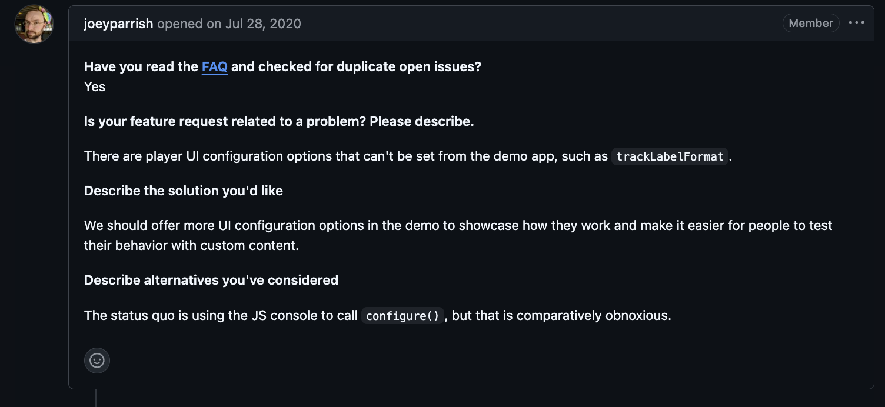

[이전 글](/shaka-add-preference/)이후 새로운 이슈를 찾던 도중 데모 UI에 커스텀 기능을 추가해달라는 이슈를 발견하게 되었습니다. 해당 이슈를 읽으며 shaka-player의 내장 UI기능들을 알아볼 수 있는 좋은 기회가 되겠다는 생각에 도전을 하게 되었습니다.

- [Issue #2755: Offer UI configuration in the demo](https://github.com/shaka-project/shaka-player/issues/2755)

## 콘솔을 열어야만 바꿀 수 있는 설정


<div class="caption">Issue #2755 - "The status quo is using the JS console to call configure(), but that is comparatively obnoxious."</div>

Shaka Player의 데모 앱에는 Config 패널이 있습니다. 재생 관련 설정(manifest, streaming, DRM 등)은 여기서 자유롭게 바꿀 수 있었는데요. 정작 **UI 관련 설정**(`shaka.extern.UIConfiguration`)은 패널에 없었습니다.

seekBar 색상을 바꾸고 싶다면? 브라우저 콘솔을 열고 직접 `configure()`를 호출해야 했습니다.

```javascript
// 콘솔에서 직접 입력해야 했던 방식
ui.configure({
  seekBarColors: {
    base: 'rgba(255, 255, 255, 0.3)',
    buffered: 'rgba(255, 255, 255, 0.54)',
    played: 'rgb(255, 255, 255)',
  },
});
```

Player 설정은 GUI로 편하게 바꾸면서 UI 설정만 콘솔을 써야 하는 건 일관성이 없었습니다. 이 이슈도 2020년에 열린 뒤 오랫동안 방치돼 있었고요.

## 이전 PR에서 얻은 감각

사실 이전 트랙 설정 PR을 진행하면서 데모 앱의 Config 시스템이 어떻게 동작하는지 이미 파악해둔 상태였습니다. `demo/config.js`에서 섹션을 나누고, 입력 필드를 만들고, URL 해시로 직렬화하는 패턴을 직접 다뤄봤거든요.

그래서 이번엔 이슈를 보자마자 "이거 바로 할 수 있겠다"는 감이 왔습니다. 기존 Player 설정 패널이 만들어지는 구조를 그대로 따라가되, UI 설정에 맞는 입력 타입들을 추가하면 됐습니다.

## 설정 타입별 입력 컴포넌트

UI 설정에는 다양한 타입의 값이 섞여 있었습니다. boolean, number, string은 기본이고, enum 값을 받는 드롭다운, 쉼표로 구분하는 문자열 배열, 숫자 배열까지. 각 타입에 맞는 헬퍼 메서드를 만들었습니다.

```javascript
addUIBoolInput_(section, name, valuePath); // 토글
addUINumberInput_(section, name, valuePath); // 숫자 입력
addUITextInput_(section, name, valuePath); // 텍스트 입력
addUISelectInput_(section, name, valuePath, options); // 드롭다운
addUIArrayStringInput_(section, name, valuePath); // 문자열 배열
addUIArrayNumberInput_(section, name, valuePath); // 숫자 배열
```

이 헬퍼들 위에 UI 설정 섹션들을 쌓아올렸습니다.

```javascript
addUISection_(); // 최상위 UI 설정
addUISeekBarColorsSection_(); // seekBar 색상
addUIVolumeBarColorsSection_(); // volumeBar 색상
addUIQualityMarksSection_(); // 화질 마크
addUIMediaSessionSection_(); // Media Session API
addUIDocumentPiPSection_(); // Document Picture-in-Picture
addUIShortcutsSection_(); // 키보드 단축키
```

Player 설정이 manifest, streaming, DRM 등으로 섹션이 나뉘어 있는 것처럼, UI 설정도 기능 단위로 나눈 겁니다. 이건 첫 리뷰에서 메인테이너가 제안한 구조이기도 했습니다.

## 기존 코드 정리

데모 앱에는 `customContextMenu`라는 설정이 별도로 관리되고 있었습니다. Meta 섹션에 하드코딩된 토글이었는데, 이건 원래 UI 설정(`shaka.extern.UIConfiguration`)에 속하는 값이었습니다.

새 UI 섹션이 생기면서 이 특수 처리가 필요 없어졌습니다. `customContextMenu_` 인스턴스 변수, getter/setter, URL 해시 파싱 로직을 모두 제거하고, UI 섹션 안에서 다른 설정들과 동일하게 처리되도록 바꿨습니다.

## 테스트 추가

기존에 Player 설정용 테스트가 있었습니다. "모든 Player config 옵션에 대응하는 데모 입력이 있는지", 반대로 "데모에 있는 입력이 실제 config에 존재하는 옵션인지" 검증하는 패턴이었는데요. 동일한 패턴으로 UI 설정 테스트를 추가했습니다.

## 마치며

이번 PR은 이전 트랙 설정 PR의 연장선이었습니다. 그때 데모 앱의 Config 시스템을 직접 다뤄봤던 경험 덕에 이번엔 조금 더 수월하게 진행할 수 있었습니다.

물론 아직도 Shaka Player 코드베이스에서 모르는 부분이 훨씬 많습니다. 다만 기여를 반복하면서 느끼는 건, 이전 PR에서 다뤘던 영역만큼은 다음에 다시 만났을 때 조금 덜 낯설다는 점입니다. 그 작은 익숙함들이 하나씩 쌓이는 게 오픈소스 기여의 재미인 것 같습니다.

> 🔗 이전 글이 궁금하시다면:
>
> - [Google Shaka Player에 첫 PR을 보냈습니다](/shaka-player/) - EME MediaKeySessionClosedReason 구현
> - [TC39 proposal-upsert를 Shaka Player에 적용하기까지](/shaka-tc39/) - Map.getOrInsert 폴리필
> - [DRM도 갱신하는 법이 다릅니다](/shaka-renewal-licensing/) - DRM 라이선스 자동 갱신
> - [라이선스 요청이 실패하면 어떻게 될까?](/shaka-retry-licensing/) - retryLicensing() 구현
> - [14개 필드를 3개로 - Shaka Player 트랙 설정의 재설계](/shaka-add-preference/) - 트랙 Preference 재설계

## 관련 링크

### GitHub

- [PR #9807: feat(Demo): offer UI configuration in the demo app](https://github.com/shaka-project/shaka-player/pull/9807)
- [Issue #2755: Offer UI configuration in the demo](https://github.com/shaka-project/shaka-player/issues/2755)
